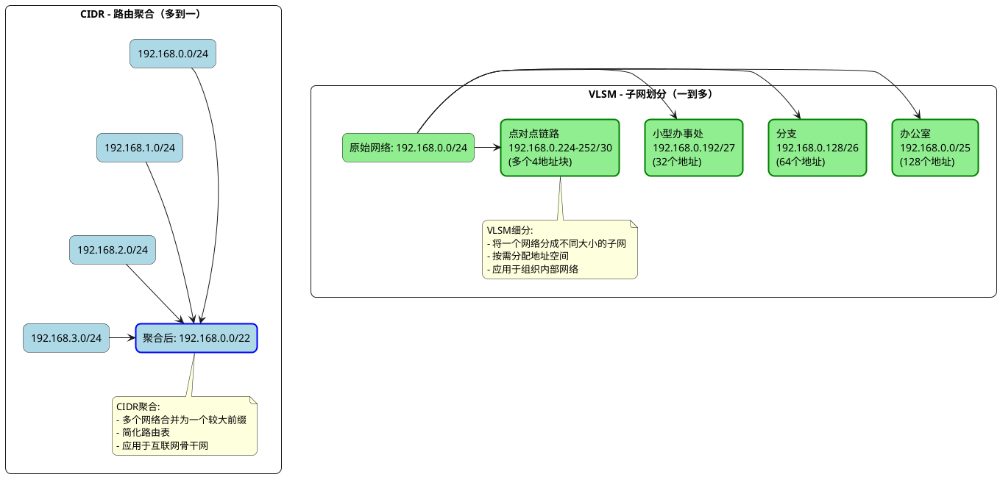

# CIDR和VLSM

在讨论RIP协议的版本演进之前，有必要了解CIDR和VLSM这两个网络地址分配技术，它们是区分RIPv1和RIPv2的关键特性。

## CIDR (无类别域间路由)

CIDR (Classless Inter-Domain Routing) 是一种在1993年引入的IP地址分配方案，用来替代传统的分类地址方案(A类、B类、C类)。

### CIDR的核心特点

- **突破传统分类界限**：摒弃了传统的A/B/C类地址固定边界限制
- **灵活的网络前缀**：使用"斜线记法"表示网络前缀长度，如192.168.1.0/24
- **支持地址聚合**：允许多个小网络聚合为一个大网络前缀，减少路由表条目
- **更高效的地址分配**：可以分配更精确大小的地址块，避免地址浪费

### CIDR的优势

- **减少路由表大小**：通过路由聚合，大幅减少互联网骨干路由器的路由表条目
- **延缓IPv4地址耗尽**：提高地址分配效率，延缓了IPv4地址资源的耗尽
- **简化路由查找**：通过最长前缀匹配算法，优化路由查找过程
- **支持超网**：允许将多个C类网络合并为一个更大的网络块

### CIDR示例

传统的C类网络地址块固定为24位网络前缀(如192.168.1.0/24)，而CIDR允许使用任意长度的网络前缀：

- 192.168.0.0/22 - 表示网络前缀为22位，包含了192.168.0.0/24到192.168.3.0/24这四个C类网络
- 10.0.0.0/8 - 表示整个A类网络
- 172.16.0.0/12 - 表示私有地址空间的B类地址块

## VLSM (可变长子网掩码)

VLSM (Variable Length Subnet Mask) 是CIDR思想在组织内部网络设计中的应用，允许在同一个主网络中使用不同长度的子网掩码。

### VLSM的核心特点

- **子网大小灵活**：可以根据实际需要的主机数量创建不同大小的子网
- **递归子网划分**：可以对一个子网再次进行子网划分，使用更长的子网掩码
- **高效地址利用**：避免了等长子网划分带来的地址浪费
- **层次化网络设计**：支持更灵活的网络层次结构设计

### VLSM的优势

- **节约IP地址资源**：根据每个网段的实际需求分配合适大小的地址空间
- **简化路由汇总**：有利于实现更有效的路由汇总，减少路由表大小
- **适应不同链路类型**：可以为点对点链路分配极小的子网(/30或/31)
- **支持网络增长**：便于未来网络扩展时进行灵活的地址规划

### VLSM示例

假设有一个192.168.0.0/24的C类网络，使用VLSM可以这样划分：

- 总部办公室需要100个IP地址：分配192.168.0.0/25（提供126个可用地址）
- 分支机构需要60个IP地址：分配192.168.0.128/26（提供62个可用地址）
- 小型办事处需要25个IP地址：分配192.168.0.192/27（提供30个可用地址）
- 点对点WAN链路：分配192.168.0.224/30、192.168.0.228/30等多个/30子网（每个提供2个可用地址）

## CIDR与VLSM的区别

虽然CIDR和VLSM都使用可变长度的网络前缀，但它们的应用场景和目的有明显区别：

### 1. 应用范围不同

- **CIDR**：主要应用于互联网骨干网和ISP网络，用于解决互联网路由表膨胀和IPv4地址耗尽问题
- **VLSM**：主要应用于组织内部网络，用于优化单个网络内的IP地址分配

### 2. 操作方向不同

- **CIDR**：通常进行"聚合"操作，将多个小网络合并为一个较大的前缀（自下而上）
- **VLSM**：通常进行"细分"操作，将一个大网络划分为多个不同大小的子网（自上而下）

### 3. 示例对比

**CIDR示例（聚合多个网络）：**
- 将192.168.0.0/24, 192.168.1.0/24, 192.168.2.0/24, 192.168.3.0/24这四个独立的C类网络聚合成一个192.168.0.0/22路由条目
- 简化了骨干网路由表，使用一个路由条目代替了四个

**VLSM示例（细分一个网络）：**
- 将一个192.168.0.0/24网络划分为多个大小不同的子网：
  - 192.168.0.0/25（128个地址）
  - 192.168.0.128/26（64个地址）
  - 192.168.0.192/27（32个地址）
  - 多个/30子网（4个地址，用于点对点链路）
- 根据实际需求分配不同大小的子网，提高地址利用率

### 4. 图解说明

以下图形对比了CIDR的路由聚合和VLSM的网络细分：

### 5. 总结

- CIDR关注的是如何在互联网上高效地管理和分配IP地址空间，通过路由聚合减少全球路由表大小
- VLSM关注的是如何在一个组织内部高效地使用已分配到的IP地址空间，通过不同大小的子网划分提高地址利用率
- 两者相辅相成：CIDR为组织分配合适大小的地址块，VLSM帮助组织内部有效利用这些地址块