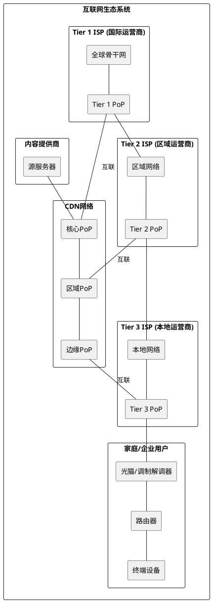

# Point of Presence (PoP) 学习笔记

> 基于 [OVHcloud文章：什么是Point of Presence](https://www.ovhcloud.com/en/learn/what-is-point-presence/)

## 1. 核心概念

Point of Presence (PoP) 是网络基础设施的关键组成部分，作为网络服务与用户之间的桥梁。它们是战略性部署在全球各地的网络节点，目的是：

- 缩短数据传输距离
- 减少网络延迟
- 提高网络性能
- 增强服务可靠性

## 2. PoP的关键功能

### 增强网络连接性
- 作为网络流量的聚合点
- 连接不同网络段，促进数据交换
- 减少数据传输距离，优化网络性能

### 改善数据传输和降低延迟
- 将数据处理点靠近用户
- 缩短数据传输路径
- 对实时应用（如视频会议、在线游戏、金融交易）至关重要

### 扩展地理覆盖范围
- 支持跨多地区运营的企业
- 确保地理分散区域的一致服务质量
- 克服地理限制，提供高效数据传输

## 3. PoP的工作原理

### 数据中心与PoP的关系
- PoP通常位于数据中心内
- 数据中心提供必要的物理基础设施和环境控制
- 提供可靠的电力、冷却系统和物理安全保障

### 路由与流量管理
- 使用复杂的路由协议（如BGP）
- 分析传入数据包，确定最佳路径
- 基于目的地和网络状况进行智能转发

### 内容分发与缓存
- 存储常用内容，减少远程获取
- 检查本地缓存，直接从PoP提供内容
- 特别适用于CDN分发大量静态内容（图片、视频、网站文件）

## 4. PoP的类型

### 公共PoP
- 由ISP或电信公司拥有和运营
- 作为不同网络之间的互联点
- 通过云互联允许不同ISP交换流量

### 私有PoP
- 由单个组织或企业专有
- 支持特定网络需求
- 为内部应用、数据中心或云服务提供专用连接

### 混合PoP网络
- 结合公共和私有PoP的元素
- 提供灵活可扩展的解决方案
- 利用公共PoP处理一般互联网连接，私有PoP处理关键应用

## 5. 部署PoP的好处

### 提高网络可靠性
- 增强网络冗余，提供多条数据传输路径
- 自动化路由转发，确保连续连接
- 最小化服务中断

### 降低延迟与提升速度
- 将数据移动到更靠近用户的位置
- 改善数据传输速度
- 提供更快的网站加载、更流畅的流媒体体验

### 分布式位置部署
- 在不同地区提供一致和高质量的用户体验
- 确保各地用户获得相同的性能和可靠性

## 6. PoP应用场景

### 内容分发网络(CDN)
- CDN依赖PoP高效向全球用户分发内容
- 对媒体丰富的网站、流媒体服务和在线游戏至关重要

### 全球企业连接
- 连接多地分散办公室的可靠安全方式
- 支持跨国企业的网络基础设施

### 云和多云连接
- 连接用户到云服务并促进多云环境
- 通过在云提供商数据中心附近部署PoP，减少延迟

## 7. 管理PoP的挑战

### 成本与基础设施维护
- 需要大量投资于基础设施、硬件和持续维护
- 包括获取或租赁数据中心空间、购买网络设备等成本

### 安全与合规考量
- 需要强大的网络安全措施防御网络攻击
- 实施防火墙、入侵检测系统等安全协议

### 管理网络冗余
- 有效管理冗余的复杂性
- 配置路由协议、实施故障转移机制

## 8. PoP部署最佳实践

### 选择战略位置
- PoP位置显著影响其性能和覆盖范围
- 考虑用户集中度的接近性

### 优化网络性能
- 实施智能路由协议优化数据流
- 利用流量整形和优先级技术

### 实施安全协议
- 部署防火墙控制网络访问
- 使用入侵检测与预防系统
- 加密传输中和静态敏感数据

## 9. 技术和工具

### 全球基础设施
- 战略性PoP部署在主要城市和互联网枢纽
- 支持BGP等路由协议
- 直接连接到主要云提供商和网络骨干

### 专用连接
- 连接提供商服务允许直接访问全球光纤骨干
- 提供低延迟和高带宽的私有连接
- 支持PoP网络扩展

### 骨干网络
- 全球光纤网络连接各数据中心
- 确保数据快速可靠传输

## 10. 重要关系解析

### PoP与ISP的关系

互联网服务提供商(ISP)与Points of Presence(PoP)之间有着密切的关系：

- **ISP运营PoP**：大多数ISP维护着自己的PoP网络，作为其整体网络基础设施的一部分
- **接入服务**：ISP利用PoP提供互联网接入服务给最终用户
- **网络边界**：PoP通常作为ISP网络的边界点，是用户流量进入ISP核心网络的门户
- **对等互联**：ISP通过PoP与其他ISP实现对等互联(Peering)，实现不同网络间的数据交换
- **服务分层**：
  - 一级ISP(Tier 1)通过自有的全球PoP网络提供国际互联网服务
  - 二级ISP(Tier 2)通过区域性PoP提供服务，同时通过与Tier 1的连接实现全球访问
  - 三级ISP(Tier 3)主要是本地服务商，通过本地PoP和上游ISP连接提供服务

### PoP与CDN的关系

内容分发网络(CDN)的核心就是分布式的PoP节点网络：

- **CDN的组成基础**：CDN本质上是由分布在全球的众多PoP节点组成的网络
- **内容缓存**：CDN在其PoP节点中缓存内容，减少从源服务器获取数据的需求
- **就近服务**：当用户请求内容时，CDN通过DNS或Anycast技术将用户引导到最近的PoP节点
- **分层架构**：
  - 边缘PoP(Edge PoP)：直接面向最终用户，提供内容交付
  - 父级PoP(Parent PoP)：作为区域集中点，连接多个边缘PoP
  - 核心PoP(Core PoP)：与源服务器连接，负责内容分发到父级和边缘PoP
- **功能延伸**：现代CDN的PoP不仅提供内容缓存，还提供安全防护(WAF、DDoS)、边缘计算等服务

### 关系可视化

下面是使用PlantUML描述PoP与ISP、CDN关系的简化图表：



这个简化版的图表清晰地展示了ISP分层结构、CDN网络架构，以及它们与PoP节点和最终用户设备(包括光猫和路由器)之间的关系。图中显示了家庭网络设备如何最终连接到ISP的PoP网络

### 网络层次视角

``` text
您的设备 → 家庭路由器 → 光猫 → 光纤 → OLT/DSLAM(位于本地PoP) → ISP骨干网络 → 互联网
```

- **核心PoP**：ISP的主要数据中心，连接到互联网骨干
- **区域PoP**：服务特定城市或区域的设备集群
- **本地PoP/接入节点**：社区级别的网络设备，如小区机房
- **最后一公里设备**：如光纤分线器、OLT等
- **用户终端设备**：光猫/调制解调器
- **用户网络设备**：家庭路由器、交换机等
- **终端设备**：电脑、手机、智能电视等

## 11. PoP对整体网络架构的影响

### 网络分层设计

PoP节点在现代网络分层设计中扮演着关键角色：

- **接入层**：作为用户接入网络的第一接触点
- **汇聚层**：集中处理来自多个接入点的流量
- **核心层**：提供高速骨干传输，连接不同区域的PoP

### 影响网络质量的关键指标

PoP部署直接影响以下网络质量指标：

- **端到端延迟**：PoP分布越广，平均访问延迟越低
- **吞吐量**：PoP节点的带宽容量决定了网络吞吐能力
- **可用性**：通过冗余PoP设计提高整体网络可用性
- **弹性**：分布式PoP架构增强网络面对故障的弹性

### 未来展望

随着技术发展，PoP网络将面临新的演进：

- **边缘计算的融合**：PoP节点将集成更多计算能力，支持边缘应用
- **5G与PoP**：5G技术将需要更密集的PoP部署来支持低延迟服务
- **智能化**：AI驱动的智能PoP管理将实现自动化优化和预测性维护
- **绿色节能**：未来PoP设计将更加注重能效和可持续性

## 总结

Point of Presence (PoP) 是现代网络架构的关键组成部分，通过将网络服务靠近用户，有效解决延迟、带宽和可靠性问题。无论是内容分发、云服务还是企业连接，合理部署和管理PoP都能显著提升网络性能和用户体验。构建PoP需要平衡位置选择、性能优化和安全措施，确保最大化其效益。
