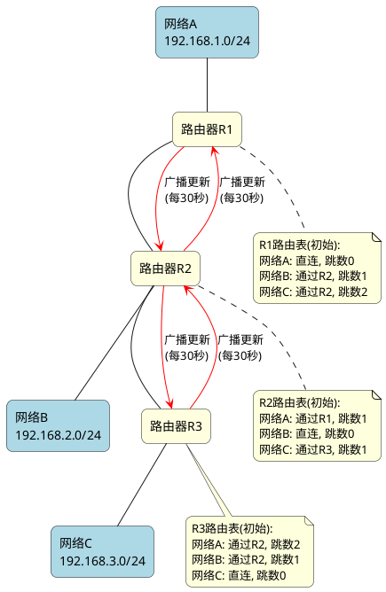
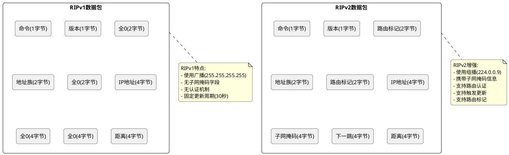
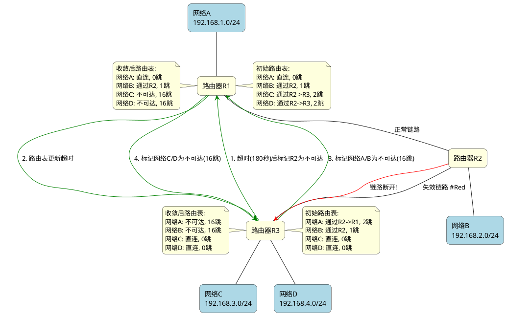
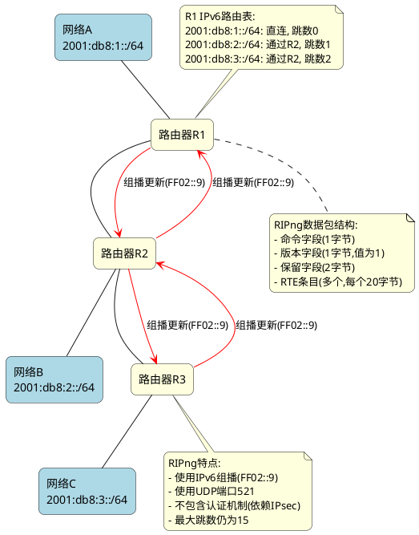
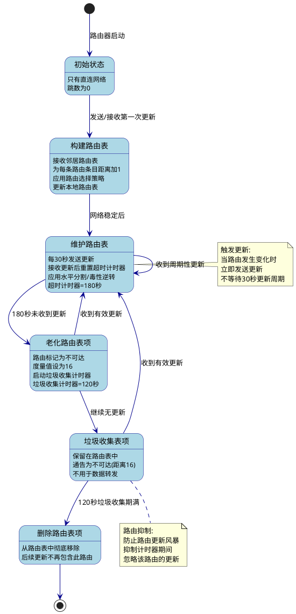

# RIP (路由信息协议)

## 基本概念

RIP (Routing Information Protocol) 是一种距离矢量路由协议，是最早的内部网关协议 (IGP) 之一，用于在自治系统内部的路由器之间交换路由信息。RIP基于Bellman-Ford算法，使用跳数（hop count）作为衡量路由距离的度量标准。

## RIP协议特点

### 优点

- **简单易实现**：协议设计简洁，容易配置和维护
- **资源消耗低**：对路由器CPU和内存要求较低
- **广泛支持**：几乎所有网络设备都支持RIP协议
- **厂商无关**：不同厂商的设备可以互相通信

### 缺点

- **扩展性差**：最大跳数限制为15跳，16跳视为不可达
  - 由于这个限制, 在大型网络中不可使用
- **收敛速度慢**：网络拓扑变化后需要较长时间达到稳定
  - 原因一：采用定期更新机制，默认30秒一次，而不是实时通知拓扑变化
  - 原因二：使用"无穷计数"（count-to-infinity）来处理路由失效，链路故障时可能需要多次定期更新才能完全收敛
  - 原因三：为防止路由环路，使用了"水平分割"和"抑制计时器"等机制，这些机制会延缓收敛
  - 原因四：默认的超时计时器设置为180秒，这意味着检测到路由失效需要等待较长时间
  - 在最坏情况下，RIP网络的完全收敛可能需要几分钟时间
- **不考虑带宽**：仅以跳数作为度量标准，忽略链路质量和带宽
- **定期更新消耗带宽**：默认每30秒广播一次完整路由表
- **存在路由环路风险**：尤其在网络拓扑变化时
- **无安全机制**：RIPv1没有认证机制，易受攻击

### CIDR和VLSM在RIP版本中的应用

- **RIPv1**：作为有类路由协议，不支持CIDR和VLSM，无法在路由更新中携带子网掩码信息
- **RIPv2**：作为无类路由协议，完全支持CIDR和VLSM，路由更新中包含子网掩码信息
- **RIPng**：设计用于IPv6，原生支持类似CIDR的地址前缀概念

## RIP协议版本

RIP协议主要有三个版本：RIPv1、RIPv2和RIPng。

### RIPv1 (RFC 1058)

- **无类路由协议**：不支持CIDR和VLSM
- **广播更新**：使用广播地址(255.255.255.255)发送更新
- **无认证机制**：不支持路由更新认证
- **不支持子网掩码**：在路由更新中不携带子网掩码信息
- **不支持路由标记**：无法区分路由来源

### RIPv2 (RFC 2453)

- **有类别路由协议**：支持CIDR和VLSM
- **组播更新**：使用组播地址(224.0.0.9)发送更新
- **支持认证**：提供简单密码和MD5认证
- **携带子网掩码**：路由更新中包含子网掩码信息
- **支持路由标记**：可区分不同来源的路由
- **支持触发更新**：网络变化时立即发送更新而不等待定时器

### RIPng (RFC 2080)

- **专为IPv6设计**：支持IPv6网络路由
- **组播更新**：使用IPv6组播地址(FF02::9)
- **不包含认证字段**：依赖IPv6的安全机制
- **扩展的寻址能力**：支持128位IPv6地址格式
- **基础工作原理与RIPv2相同**

## RIP协议工作原理

### 基本工作流程

1. **初始化**：路由器启动时只知道直连网络
2. **交换路由表**：定期（默认30秒）向邻居发送路由表
3. **更新路由**：接收到邻居路由表后，对每条路由加1跳并比较
4. **选择路由**：选择跳数最小的路径作为最佳路径
5. **超时处理**：如果180秒内未收到更新，将路由标记为可能无效
6. **垃圾收集**：标记为无效的路由在120秒后从路由表中删除

### 传输层特性

RIP是基于UDP协议的路由协议，有以下关键特点：

- **UDP端口**：
  - RIPv1和RIPv2使用UDP端口520
  - RIPng使用UDP端口521

- **为什么选择UDP**：
  - **简单性**：UDP是无连接协议，实现简单
  - **低开销**：UDP头部只有8字节，比TCP的20字节小得多
  - **广播/组播支持**：UDP天然支持广播和组播通信
  - **定期更新机制**：RIP本身的定期更新和超时机制可以弥补UDP不可靠的特性

- **数据包最大大小**：
  - 整个RIP消息（包括UDP头部和IP头部）不得超过512字节
  - 这个限制与DNS等其他UDP协议一致，确保消息能在大多数网络中不分片传输
  - 由于这个限制，RIP数据包最多可包含25个路由条目（每个路由条目20字节）

- **数据包结构**：
  ```
  +----------------+----------------+
  |     UDP头      |    RIP数据     |
  +----------------+----------------+
  | 源端口: 520    | 命令(1字节)    |
  | 目标端口: 520  | 版本(1字节)    |
  | 长度           | 必须为零(2字节)|
  | 校验和         | 路由条目(每个20字节) |
  +----------------+----------------+
  ```

- **命令字段**：
  - 1 = 请求(Request)：请求其他路由器提供全部或部分路由表
  - 2 = 响应(Response)：包含发送方路由表的信息，可能是对请求的回应或定期/触发更新

- **版本字段**：
  - RIPv1 = 1
  - RIPv2 = 2
  - RIPng = 1（尽管是IPv6版本，但其版本号也是1）

- **RIPv1路由条目格式**：
  ```
  +-------------------------------+-------------------------------+
  | 地址族标识符(2字节)           | 必须为零(2字节)               |
  +-------------------------------+-------------------------------+
  | IPv4地址(4字节)               |
  +---------------------------------------------------------------+
  | 必须为零(4字节)               |
  +---------------------------------------------------------------+
  | 必须为零(4字节)               |
  +---------------------------------------------------------------+
  | 度量值(4字节)                 |
  +---------------------------------------------------------------+
  ```

- **RIPv2路由条目格式**：
  ```
  +-------------------------------+-------------------------------+
  | 地址族标识符(2字节)           | 路由标记(2字节)               |
  +-------------------------------+-------------------------------+
  | IPv4地址(4字节)               |
  +---------------------------------------------------------------+
  | 子网掩码(4字节)               |
  +---------------------------------------------------------------+
  | 下一跳地址(4字节)             |
  +---------------------------------------------------------------+
  | 度量值(4字节)                 |
  +---------------------------------------------------------------+
  ```

- **RIPng路由条目格式**：
  ```
  +-------------------------------+-------------------------------+
  | IPv6前缀(16字节)              |
  +---------------------------------------------------------------+
  | 路由标记(2字节)               | 前缀长度(1字节) | 必须为零(1字节) |
  +-------------------------------+-------------------------------+
  | 度量值(4字节)                 |
  +---------------------------------------------------------------+
  ```

- **可靠性保证**：
  虽然UDP不提供可靠传输，但RIP通过以下机制确保路由信息的可靠性：
  - 定期完整更新（默认30秒一次）
  - 触发更新（当网络发生变化时）
  - 超时机制（180秒无更新后标记路由为无效）
  - 垃圾收集（120秒清理无效路由）

- **与其他路由协议对比**：
  - OSPF直接使用IP协议（协议号89）而非TCP/UDP
  - EIGRP直接使用IP协议（协议号88）而非TCP/UDP
  - BGP使用TCP端口179，需要可靠的连接

UDP的轻量级特性使RIP适合在资源有限的设备上运行，但其不可靠性也是RIP在大型网络中表现不佳的因素之一。

### 防止路由环路机制

- **水平分割**：不向某接口通告从该接口学到的路由
- **毒性逆转**：向学到路由的接口通告该路由为不可达(16跳)
- **触发更新**：路由变化时立即发送更新而不等待定时器
- **抑制计时器**：路由变为无效后一段时间内不接受该路由的更新

## RIP协议工作示例

### RIPv1更新机制



### RIPv2与RIPv1的区别



### RIP路由收敛过程



#### RIP路由收敛过程文字解释

上图展示了RIP协议在网络拓扑发生变化后的收敛过程。收敛指的是路由协议在网络变化后，所有路由器重新计算并更新路由表，直到网络达到稳定状态的过程。具体解释如下：

1. **初始状态**：
   - 网络中有三台路由器(R1、R2、R3)和四个网络(A、B、C、D)
   - 每台路由器都已学习到完整的路由信息
   - R1通过R2可以访问网络C和D
   - R3通过R2可以访问网络A和B

2. **链路故障**：
   - R2和R3之间的链路突然断开（图中红色标记的失效链路）
   - 但由于RIP是定期更新机制，路由器不会立即感知到链路故障

3. **收敛阶段**：
   - **第一步**：R3等待180秒（超时计时器）后发现没有收到来自R2的更新，将R2标记为不可达
   - **第二步**：R1的路由表也开始超时，因为没有收到经过R2→R3到达网络C和D的更新
   - **第三步**：R3将网络A和B标记为不可达（16跳，在RIP中表示无限远）
   - **第四步**：R1将网络C和D标记为不可达（16跳）

4. **收敛完成**：
   - R1的最终路由表：只保留直连网络A和通过R2可达的网络B
   - R3的最终路由表：只保留直连网络C和D
   - 网络分裂为两部分，R1和R3无法相互通信

这个收敛过程的关键特点是：

- **缓慢性**：整个过程需要等待超时计时器（默认180秒），导致收敛速度慢
- **逐步性**：路由更新是逐步传播的，不是一次性完成
- **最终一致性**：尽管过程缓慢，但最终所有路由器都会达到一致的路由视图
- **有限计数**：使用16跳表示不可达路由，避免无限循环

RIP的这种收敛特性是其在大型网络中不受欢迎的主要原因之一，因为网络中断后需要较长时间才能恢复正常路由。

### RIPng(IPv6)工作示例



### RIP工作机制

RIP路由协议运行过程可分为以下几个阶段：

#### 1. 初始状态

- 路由器启动RIP进程后，初始路由表仅包含直连网络
- 这些直连网络的跳数为0
- 此时路由器无法到达非直连网络
- 路由器准备通过交换路由信息来学习整个网络的拓扑结构

#### 2. 构建路由表

- 每个运行RIP的路由器以广播(RIPv1)或组播(RIPv2)方式向邻居发送路由更新
- 路由器接收到邻居的路由更新后，处理每条路由条目：
  - 对距离向量加1（表示经过一个额外的路由器）
  - 如果路由表中没有该目的网络，且距离小于16，则添加该路由
  - 如果已有该网络的路由，但新路由的距离更短，则更新路由表
  - 如果新路由来自同一下一跳路由器，则无论距离如何都更新路由表
- 经过几轮更新后，所有路由器都将获得完整的网络视图（收敛）

#### 3. 维护路由表

- 路由器每30秒向所有接口发送一次完整的路由更新
- 应用水平分割技术：不向某接口通告从该接口学到的路由
- 对于路由表中的每个条目，维护一个超时计时器（默认180秒）
- 每次从路由源接收到更新时，重置该路由的超时计时器
- 触发更新：当路由信息发生变化时（如链路故障），立即发送更新，而不等待30秒的更新周期

#### 4. 老化路由表项

- 如果180秒内没有收到某路由的更新信息，该路由条目被标记为可能失效
- 将该路由的距离（度量值）设置为16（表示不可达）
- 启动垃圾收集计时器（默认120秒）
- 路由条目仍然保留在路由表中，但不再用于数据包转发
- 在路由更新中，该路由会被通告为不可达（距离为16）

#### 5. 垃圾收集表项

- 进入垃圾收集阶段的路由条目继续参与路由更新，但标记为不可达
- 这样设计是为了确保不可达信息能够传播到网络的所有部分
- 在垃圾收集期间，如果接收到该路由的新有效更新，路由可以被"复活"：
  - 更新该路由的距离和下一跳信息
  - 重置超时计时器
  - 取消垃圾收集计时器

#### 6. 删除路由表项

- 如果垃圾收集计时器（120秒）到期，且没有收到新的有效更新
- 路由条目将从路由表中完全删除
- 该网络在后续的路由更新中不再包含任何信息
- 如果以后再次收到该网络的路由信息，将被视为新路由处理



#### RIP计时器总结

| 计时器名称 | 默认值 | 作用 |
|-----------|-------|------|
| 更新计时器 | 30秒 | 定期发送路由更新的时间间隔 |
| 超时计时器 | 180秒 | 路由条目从上次更新到标记为不可达的时间 |
| 垃圾收集计时器 | 120秒 | 从标记不可达到彻底删除的时间 |
| 抑制计时器 | 可变 | 防止路由更新风暴的时间 |

#### RIP防环机制总结

为了防止路由环路和减少收敛时间，RIP采用以下机制：

1. **最大跳数限制**：最大跳数为15，16表示无限远（不可达）
2. **水平分割**：不向某接口通告从该接口学到的路由
3. **毒性逆转**：向学到路由的接口通告该路由为不可达（跳数16）
4. **触发更新**：路由变化时立即发送更新，加速网络收敛
5. **抑制计时器**：防止路由振荡，在一段时间内不接受特定路由的更新

尽管有这些机制，RIP仍然可能在某些网络拓扑下遇到"慢收敛"或"计数到无穷大"问题，这也是它在大型网络中不受欢迎的原因之一。

## 总结

RIP是一种简单但功能有限的路由协议,适用于小型网络。随着网络规模扩大和技术进步,RIP逐渐被OSPF、EIGRP等更先进的路由协议取代,但在简单网络和边缘设备上仍有使用价值。三个版本(RIPv1、RIPv2、RIPng)的演进反映了网络技术的发展历程,从无类路由到CIDR,再到IPv6的支持

## 参考

- [RFC 2453: RIP Version 2](https://tools.ietf.org/html/rfc2453)
- [RIP 路由协议详解](https://cshihong.github.io/2018/03/23/RIP%E5%9F%BA%E7%A1%80%E7%9F%A5%E8%AF%86/)

## RIP协议实现的参考项目

如果想了解RIP协议的具体实现，可以研究以下开源项目的源码：

1. **FRRouting (FRR)** - 一个功能完整的路由协议套件，包含RIP、RIPng等实现
   - 主仓库：[https://github.com/FRRouting/frr](https://github.com/FRRouting/frr)
   - RIPv2实现目录：`/ripd`
   - RIPng实现目录：`/ripngd`

2. **BIRD Internet Routing Daemon** - 轻量级但功能强大的路由守护进程
   - 主仓库：[https://gitlab.labs.nic.cz/labs/bird/](https://gitlab.labs.nic.cz/labs/bird/)
   - 文档：[https://bird.network.cz/?get_doc&v=16&f=bird-6.html](https://bird.network.cz/?get_doc&v=16&f=bird-6.html)
   - RIP实现文件位于`proto/rip`目录

3. **Quagga** - FRRouting的前身，同样包含完整的RIP实现
   - Quagga-EIGRP：[https://github.com/janjanovicsk/Quagga-EIGRP](https://github.com/janjanovicsk/Quagga-EIGRP)
   - RIP实现目录：`/ripd`

这些项目都遵循RFC 2453(RIPv2)和RFC 2080(RIPng)规范，提供了RIP协议的完整实现，包括：
- 路由表管理
- 定时更新机制
- 路由老化和垃圾收集
- 水平分割和毒性反转
- 触发更新
- 认证机制

通过阅读这些源码，可以深入理解RIP协议的工作原理及其在实际路由器中的实现方式。