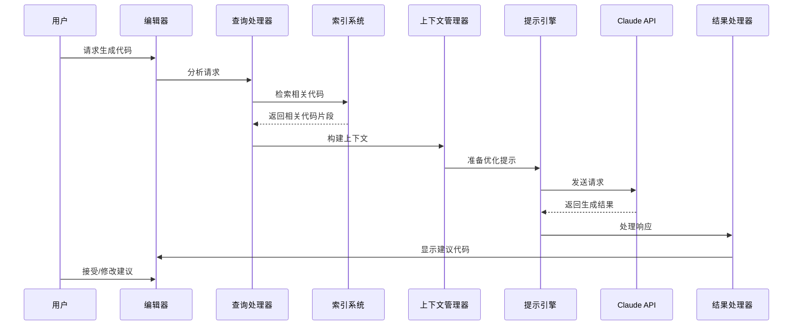

# Cursor 检索增强生成（RGA）实现设计文档

## 1. 引言

### 1.1 目的

本文档详细描述Cursor编辑器如何结合Claude模型和本地工程索引文件实现高效的检索增强生成（Retrieval-Augmented Generation，RGA）功能，提供智能编码辅助。

### 1.2 范围

文档涵盖Cursor的系统架构、核心组件、RGA实现方式、工作流程和关键技术细节，重点关注本地代码索引与Claude模型的协同工作。

### 1.3 背景

传统AI编码助手通常仅依赖语言模型的通用知识，缺乏对用户当前项目的深入理解。Cursor通过RGA技术，将本地代码库的上下文信息整合到生成过程中，提供更精确、更贴合项目的代码建议和解决方案。

## 2. 系统架构概述

### 2.1 高层架构

Cursor采用客户端-服务器架构，主要由以下部分组成：

1. **客户端组件**：提供用户界面和本地处理能力
   - 编辑器核心
   - 本地索引系统
   - 上下文管理器
   - 查询处理器
   - 结果渲染器

2. **服务端组件**：提供AI能力和云端服务
   - Claude API集成
   - 用户认证服务
   - 遥测与分析系统

3. **通信层**：连接客户端和服务端
   - 安全API通道
   - 数据序列化与压缩

### 2.2 架构示意图

Cursor的RGA功能依赖于多个组件的协同工作，整体架构如下图所示：

[Cursor RGA架构图](docs/cursor_architecture.puml)

## 3. 本地代码索引系统

本地代码索引系统是Cursor RGA功能的基础，负责构建和维护项目代码的语义理解。

### 3.1 索引构建流程

1. **初始扫描**：用户打开项目时，系统扫描全部代码文件
2. **解析与符号提取**：使用语言特定解析器解析代码
3. **AST生成**：构建抽象语法树，提取语义信息
4. **向量化**：将代码片段转换为语义向量
5. **索引存储**：将向量存入本地向量数据库

### 3.2 增量更新机制

为保证性能，Cursor采用增量更新策略：

```
监测文件变更 → 局部解析 → 更新受影响的索引部分 → 刷新向量数据库
```

### 3.3 索引数据结构

索引包含多层次信息：

1. **文件级别索引**：文件路径、类型、总体内容向量
2. **符号级别索引**：函数、类、变量等符号的定义和引用
3. **块级别索引**：代码块的语义向量和关系
4. **依赖关系索引**：模块间依赖、导入关系

### 3.4 向量数据库实现

Cursor可能使用类似FAISS或Qdrant的嵌入式向量数据库，特点包括：

- 高效相似度搜索
- 低内存占用
- 增量更新支持
- 持久化存储

## 4. 查询理解与上下文构建

### 4.1 用户意图识别

Cursor分析用户查询，从而识别：

- 代码生成需求
- 问题解答需求
- 代码解释需求
- 重构或优化需求

### 4.2 上下文收集策略

基于识别的意图，Cursor采用不同策略收集上下文：

1. **局部上下文**：当前文件、光标位置周围代码
2. **相关符号上下文**：与查询相关的函数、类定义
3. **项目结构上下文**：文件组织、依赖关系
4. **历史交互上下文**：之前的对话和操作

### 4.3 智能上下文剪裁

为适应Claude模型的上下文窗口限制，Cursor采用多种技术优化上下文：

- 相关性排序和截断
- 代码压缩表示
- 重要信息提取
- 动态上下文调整

## 5. 与Claude模型的集成

### 5.1 API通信流程

```
构建优化提示 → 发送API请求 → 接收流式响应 → 解析处理结果
```

### 5.2 提示工程优化

Cursor针对编程场景设计专门的提示模板：

```
系统提示（角色定义）+ 项目上下文 + 相关代码片段 + 用户查询
```

### 5.3 Claude特性利用

Cursor充分利用Claude模型的特性：

- 长上下文理解能力
- 代码理解和生成能力
- 多轮对话能力
- 工具使用能力

### 5.4 响应处理与增强

Cursor对Claude返回的响应进行处理：

- 语法高亮和格式化
- 代码补全建议整合
- 文档链接和参考添加
- 错误检测和修复建议

## 6. 核心工作流程

### 6.1 用户查询处理流程

1. **查询提交**：用户在编辑器或AI面板提交问题
2. **查询分析**：系统分析查询意图和需求
3. **上下文收集**：根据查询检索相关代码片段
4. **提示构建**：组装查询、上下文和指令
5. **API调用**：向Claude发送请求
6. **响应处理**：处理并展示Claude的回答
7. **用户交互**：用户可以继续提问或采纳建议

### 6.2 代码生成流程



### 6.3 智能问答流程

与代码生成类似，但更注重信息检索和解释：

1. 用户提出关于代码的问题
2. 系统检索相关代码定义和文档
3. 构建包含这些信息的上下文
4. Claude生成考虑项目特定实现的解答
5. 结果中可能包含代码示例和参考链接

## 7. 性能优化

### 7.1 索引性能

- 使用工作线程进行后台索引
- 采用分层索引减少内存占用
- 优先索引活跃文件和重要符号
- 缓存常用查询结果

### 7.2 响应时间优化

- 流式处理Claude响应
- 预测性上下文收集
- 查询结果缓存
- 本地小模型辅助处理简单查询

### 7.3 大型项目支持

- 选择性索引策略
- 智能忽略非关键文件（如生成代码、依赖库）
- 项目分区索引
- 增量更新优先级排序

## 8. 安全与隐私

### 8.1 本地数据处理

- 代码索引存储在本地
- 私密信息检测和过滤
- 用户可控的数据共享范围

### 8.2 API安全通信

- 加密传输
- 最小必要数据原则
- 认证和授权机制

## 9. 技术挑战与解决方案

### 9.1 上下文窗口限制

**挑战**：Claude模型有上下文窗口限制，而代码项目通常很大。

**解决方案**：
- 智能上下文选择算法
- 代码压缩和总结技术
- 多次查询拆分复杂问题

### 9.2 代码理解精度

**挑战**：准确理解用户项目的语义和结构。

**解决方案**：
- 语言特定解析器
- 符号关系图构建
- 类型信息提取
- 语义相似度优化

### 9.3 用户查询模糊性

**挑战**：用户查询可能不精确或包含多个意图。

**解决方案**：
- 查询意图分类
- 交互式查询精确化
- 上下文感知的查询处理

## 10. 未来发展

### 10.1 技术路线图

- 多模型支持（除Claude外支持其他模型）
- 本地模型集成，实现混合计算
- 更深入的代码分析和理解
- 用户协作和知识共享功能

### 10.2 性能提升计划

- 优化索引算法
- 改进向量检索效率
- 提示模板持续优化
- 缓存策略增强

## 11. 总结

Cursor通过精心设计的本地索引系统与Claude模型集成，实现了高效的检索增强生成功能。这种方法将AI的通用能力与项目特定知识相结合，为开发者提供了上下文感知的智能编码辅助。

系统的模块化设计和优化策略使其能够处理各种规模的项目，同时保持良好的性能和用户体验。随着技术的不断演进，Cursor的RGA功能将进一步增强，为软件开发提供更强大的AI辅助能力。 