# 发布策略比较：蓝绿发布 vs 灰度发布

## 本质区别

### 蓝绿发布 (Blue-Green Deployment)
蓝绿发布的本质是**环境切换**，通过准备两套完全相同的环境（蓝环境和绿环境），在不同环境间快速切换流量。

### 灰度发布 (Canary Deployment)
灰度发布的本质是**流量控制**，通过逐步将流量从旧版本迁移到新版本，实现平滑过渡。

## 场景对比

| 特性 | 蓝绿发布 | 灰度发布 |
|------|---------|---------|
| **核心思想** | 完全切换 | 渐进迁移 |
| **风险控制** | 全有或全无 | 精细控制风险范围 |
| **回滚方式** | 立即完全回滚 | 调整流量比例 |
| **资源需求** | 需要两倍资源 | 资源可逐步扩展 |
| **适用场景** | 确定性强的变更 | 不确定性高的变更 |

## 蓝绿发布

### 适用场景
- 需要零停机时间的关键业务系统
- 有足够资源支持两套环境
- **变更内容经过充分测试，确定性高**
- 数据库结构无重大变更

### 优势
1. **快速切换**：一次性完成所有用户的版本切换
2. **回滚简单**：出现问题时可立即切回旧环境
3. **环境隔离**：新旧版本完全分离，避免干扰
4. **验证充分**：可在切换前对新环境进行完整验证

### 劣势
1. **资源消耗大**：需要维护两套完全相同的环境
2. **全有或全无**：**不能进行小规模测试，风险暴露面大**
3. **数据同步挑战**：两套环境的数据同步可能复杂
4. **成本高**：由于资源翻倍，成本相应提高

### 共享数据库场景下的回滚挑战

在实际应用中，蓝绿发布经常面临一个重要选择：是为每个环境维护独立数据库，还是共享同一个数据库。共享数据库方案可以简化部署复杂度，但在回滚场景下存在特殊挑战。

#### 共享数据库的蓝绿架构

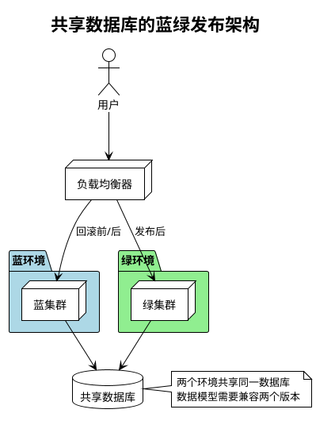

#### 数据兼容性问题

当绿环境发布失败需要回滚时，可能已经对共享数据库进行了一系列修改：

1. **数据库架构变更**：新版本可能添加了表、列或索引
2. **数据格式变更**：现有数据可能已按新格式转换或扩充
3. **新增数据记录**：可能已写入只有新版本才能正确解析的数据

#### 回滚后的持续运行能力分析

绿环境失败回滚到蓝环境后，蓝环境是否能继续正常工作取决于以下几个方面：

| 变更类型 | 回滚影响 | 蓝环境能否继续工作 |
|---------|---------|-------------------|
| **仅添加字段/表** | 数据库有额外字段/表，但旧版本不访问 | ✅ 通常可以继续工作 |
| **修改现有字段语义** | 数据含义可能已变更 | ⚠️ 可能工作但有数据解释风险 |
| **数据格式变更** | 旧版本可能无法解析新格式 | ❌ 可能导致错误或数据损坏 |
| **数据库约束变更** | 可能违反旧版本假设 | ❌ 可能出现完整性错误 |

#### 处理策略

共享数据库场景下回滚的最佳实践：

1. **数据库变更原则**：
   - **采用增量方式**：只添加不修改或删除
   - **向后兼容设计**：确保新表/字段不影响旧代码
   - **推迟约束添加**：在确认发布成功后再添加约束
   - **数据双写**：关键数据同时以新旧格式存储

2. **回滚准备**：
   - **预先编写回滚SQL脚本**：针对各种可能的失败点
   - **推迟数据清理**：成功发布后等待一定时间再清理旧数据
   - **数据库状态快照**：在关键节点创建数据库状态快照

3. **高级回滚策略**：
   - **部分数据库回滚**：只回滚受影响的表或记录
   - **读写分离**：回滚后蓝环境只写入旧表，但可读取新旧两种表
   - **业务逻辑补偿**：通过业务代码处理不一致数据

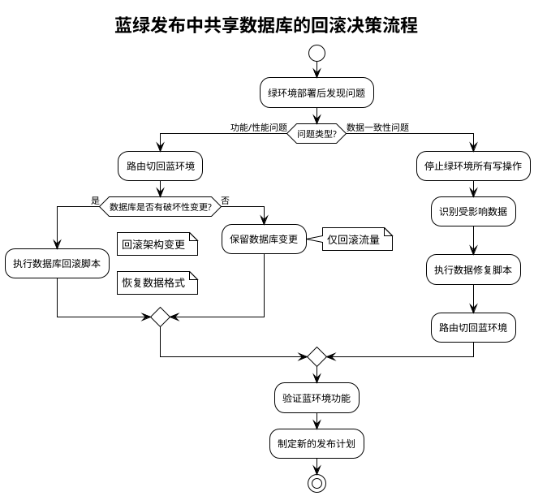

#### 案例分析

**成功案例**：某电商平台共享数据库模式下回滚后蓝环境继续工作

```
发布内容：商品展示页改版，添加了新的商品属性字段
数据库变更：仅添加新表和字段，保留所有原有表结构
绿环境问题：发现新页面在特定浏览器上渲染错误
回滚过程：
1. 将流量切回蓝环境
2. 保留新增的数据库表和字段（不影响旧版本）
3. 蓝环境成功继续运行，使用原有字段和表
4. 修复UI问题后重新部署绿环境
```

**失败案例**：某金融系统共享数据库回滚导致数据不一致

```
发布内容：交易系统升级，修改了交易状态的处理逻辑
数据库变更：修改了现有状态字段的含义，新增了状态值
绿环境问题：处理高并发交易时出现性能瓶颈
回滚问题：
1. 流量切回蓝环境后，蓝环境无法正确解释绿环境写入的新状态值
2. 部分交易显示错误状态，导致客户投诉
3. 需要紧急开发数据修复脚本，并暂停部分功能
教训：状态字段变更应使用新字段而非复用现有字段
```

#### 结论

共享数据库的蓝绿发布在回滚场景下需要特别谨慎：

1. **明确权衡**：共享数据库简化了部署但增加了回滚复杂性
2. **预先规划**：数据库变更应具备双向兼容性
3. **关键准则**：确保蓝环境能够正确处理或优雅忽略绿环境引入的数据库变更
4. **考虑替代方案**：对于关键系统，可考虑蓝绿环境使用独立数据库，通过数据同步机制保持一致性

## 灰度发布

### 适用场景
- 对新功能的用户反应有不确定性
- 需要逐步验证新版本的性能和稳定性
- 资源有限，无法支持完整的双环境
- 希望获取早期用户反馈进行调整

### 优势
1. **风险可控**：**可以控制受影响用户比例**
2. **资源利用率高**：可以逐步扩展新版本资源
3. **用户反馈循环**：可以从早期用户获取反馈
4. **灵活调整**：可根据监控结果动态调整发布速度

### 劣势
1. **部署时间长**：完成全部用户迁移需要较长时间
2. **复杂度高**：需要更复杂的流量控制机制
3. **监控要求高**：需要精细的监控和告警系统
4. **用户体验不一致**：同时存在多个版本可能导致**用户体验不一致**

## 为什么灰度发布扩展到100%不能完全替代蓝绿发布？

尽管从技术上讲灰度发布可以逐步扩展到100%流量，但蓝绿发布在某些场景下仍然具有不可替代的优势：

### 1. 原子性切换的优势

- **确定性和一致性**：蓝绿发布提供了一个确定的切换点，所有用户同时体验新版本，避免了不同用户看到不同版本的问题
- **测试的完整性**：绿环境在切换前可以进行完整的系统级测试，包括负载测试和集成测试，确保整个系统的兼容性
- **简化的状态管理**：不需要处理新旧版本并行运行时的状态兼容性问题

### 2. 运维和管理方面的差异

- **监控复杂度**：蓝绿发布只需监控两个完整环境，而灰度发布需要同时监控多个版本的混合状态
- **问题定位**：蓝绿部署中的问题更容易隔离和定位，因为环境是完全独立的
- **运维操作**：蓝绿发布的操作模型更简单，只有切换和回滚两个关键操作点

### 3. 特定业务场景的需求

- **不可分割的系统变更**：某些变更必须作为一个整体一次性应用，无法逐步推进
- **配合数据库架构变更**：当应用更新涉及数据库架构变更时，蓝绿发布配合数据库迁移策略更有优势
- **合规和审计需求**：某些受监管行业需要明确的版本切换点以满足审计要求

### 4. 资源利用效率

- **短期vs长期成本**：虽然蓝绿需要短期内两倍资源，但完成切换后可以立即释放旧环境资源
- **环境复用**：蓝绿发布中的环境可以循环使用，形成有效的发布周期
- **维护简化**：不需要同时维护多个版本的运行时环境和配置

### 5. 实际案例对比

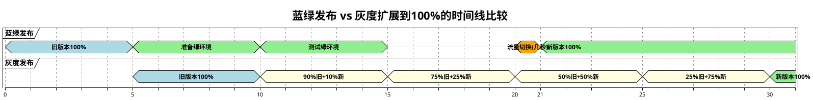

从时间线可以看出，蓝绿发布在切换点提供了原子性变更，而灰度发布则需要较长的过渡期。

### 6. 蓝绿发布的时间维度不一致性分析

确实，蓝绿发布也存在不一致性问题，但与灰度发布的不一致性有根本区别：

#### 蓝绿发布中的不一致性

- **时间维度的不一致**：在切换点前后，用户体验的是不同版本
- **数据兼容性挑战**：切换前后的数据状态需要保持一致性

#### 与灰度发布不一致性的本质区别

- **不一致性的维度不同**
  - 蓝绿发布：在**时间维度**上存在不一致（切换前vs切换后）
  - 灰度发布：在**用户群体维度**上存在不一致（同一时间不同用户看到不同版本）

- **业务影响的可预测性**
  - 蓝绿发布：不一致性发生在可预测的时间点，可以提前规划和沟通
  - 灰度发布：不同用户同时体验不同版本，难以预测和控制业务交互场景

- **数据一致性处理方式**
  - 蓝绿发布：通常采用数据库向前兼容策略和数据同步机制，确保切换时数据一致性
  - 灰度发布：需要同时支持新旧版本的数据模型，处理复杂性更高

#### 蓝绿发布在版本转换中的优势

1. **可控的转换点**：
   - 可以选择业务低峰期进行切换
   - 可以向用户明确告知系统升级时间
   - 切换时可以设置短暂的只读模式或维护窗口

2. **数据处理策略**：
   - 可以实施完整的数据迁移策略
   - 可以利用数据库模式演进技术（如扩展表而非直接修改）
   - 切换前进行完整数据校验

3. **边界清晰的测试**：
   - 可以完整测试切换前后的业务流程
   - 对问题可以更精确定位到"切换前"或"切换后"

4. **示例说明**：

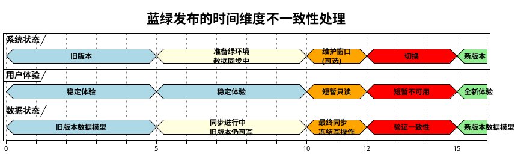

通过这种方式，蓝绿发布能够更好地控制版本转换过程，将不可避免的不一致性限制在一个可预见、可控制的时间窗口内，从而在保证系统稳定性的同时，提供更一致的用户体验。

## 选择依据
- 选择**蓝绿发布**：当变更确定性高，需要快速切换，有足够资源支持
- 选择**灰度发布**：当变更风险不确定，希望逐步验证，资源有限

## 实现图解

### 蓝绿发布流程

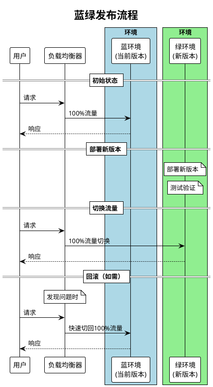

### 灰度发布流程

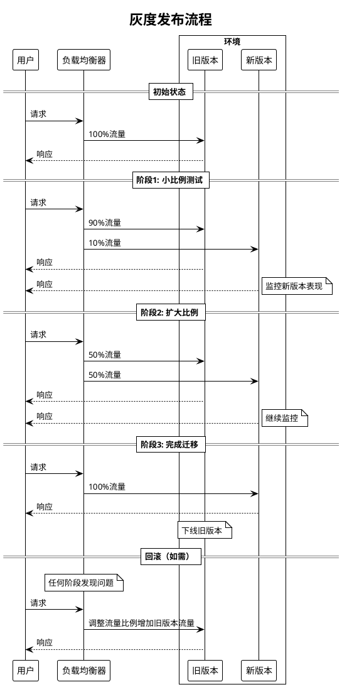

## 实际应用建议

1. **混合策略**：在实际应用中，可以结合两种策略的优点
   - 先使用灰度发布验证新版本
   - 验证无误后，使用蓝绿方式快速完成切换

2. **关键考量因素**：
   - 业务中断容忍度
   - 资源成本约束
   - 回滚需求和速度
   - 用户体验一致性要求
   - 监控和观测能力

3. **辅助实践**：
   - 自动化测试覆盖
   - 完善的监控告警
   - 特性开关 (Feature Toggles)
   - A/B测试能力

## 结论

蓝绿发布和灰度发布各有所长，选择合适的发布策略应基于具体业务场景、风险承受能力和资源情况。在实践中，往往需要结合多种策略，并配合完善的DevOps流程，才能实现安全、高效的应用发布。

尽管灰度发布看起来可以通过扩展到100%流量来替代蓝绿发布，但两者在本质上解决的问题不同：蓝绿发布追求的是确定性和一致性，而灰度发布追求的是风险的渐进控制。即使蓝绿发布在时间维度上存在版本不一致的情况，其可控的切换点和明确的边界仍然为许多业务场景提供了不可替代的优势。在复杂的企业环境中，通常需要根据不同的变更类型选择适合的策略，或者综合运用两种策略的优点。

## 消息队列场景下的蓝绿发布策略

### 问题背景：Kafka消费者场景下的有状态会话流迁移

在使用Kafka等消息队列系统处理有状态会话流的场景下，蓝绿发布面临着特殊的挑战。以下是一个典型场景：

- 业务系统从Kafka的一个topic消费消息
- 消息按照dialog id作为key分配到不同的partition
- 一个业务流程包含多个消息事件，以start event为起点，后续消息都有相同的dialog id
- 需要对系统进行蓝绿发布升级

### 挑战分析

在这种场景下直接应用蓝绿发布策略会面临以下挑战：

1. **会话完整性问题**：
   - 如果在时间点x切换，x之前的start event由blue集群处理，但后续相关事件在x之后到达
   - 如何确保同一dialog id的所有事件都由同一个集群（blue或green）处理?

2. **消费者组行为**：
   - Kafka的消费者组机制会在消费者加入或离开时触发再平衡(rebalance)
   - 如何避免rebalance导致的消息处理中断或重复?

3. **偏移量(offset)管理**：
   - 使用"latest"消费策略可能导致消息丢失
   - 集群从头开始消费又会导致重复处理

### 解决方案分析

针对提出的场景，以下是可能的解决方案及其评估：

#### 方案1：基于消息key的路由分流（不推荐）

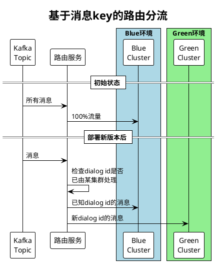

**分析**：
- 需要额外的路由服务记录dialog id与处理集群的映射
- 增加了架构复杂性，引入了新的故障点
- 消息顺序可能难以保证

#### 方案2：时间窗口 + 双消费模式（推荐）

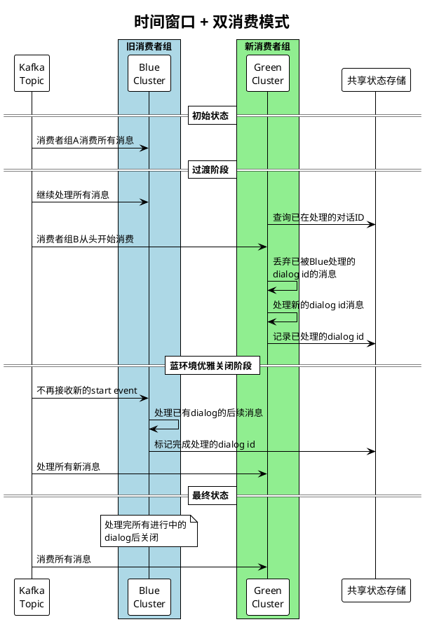

**实现步骤**：

1. **准备阶段**：
   - 确保消息中包含时间戳和dialog id信息
   - 设置共享状态存储（如Redis），用于记录dialog id的处理状态

2. **部署阶段**：
   - 部署绿环境，使用新的消费者组ID
   - 绿环境从适当的offset开始消费（可以使用earliest并跳过已处理的dialog）
   - 绿环境仅处理未被蓝环境处理的新dialog id

3. **迁移阶段**：
   - 蓝环境停止接收新的start event
   - 蓝环境继续处理已经开始的dialog流程，直到完成
   - 绿环境接管所有新的start event

4. **完成阶段**：
   - 当蓝环境处理完所有进行中的对话后，优雅关闭
   - 绿环境处理所有新消息

**优势**：
- 保证了dialog完整性，同一dialog的所有事件由同一集群处理
- 避免了消息丢失
- 无需修改Kafka的分区分配逻辑

**挑战**：
- 需要管理共享状态存储
- 临时性的重复处理（可通过消息去重机制解决）
- 过渡期间资源利用率不均衡

#### 方案3：独立topic + 数据迁移（适用于长期会话）

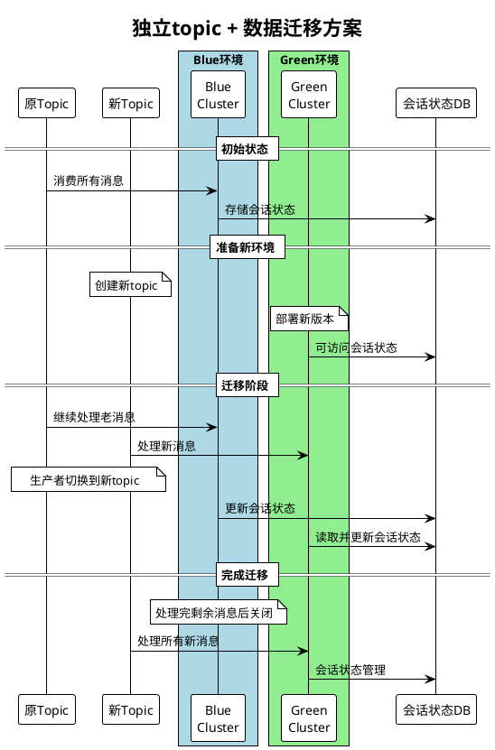

**适用场景**：
- 会话状态持久化存储在外部数据库
- 会话周期较长
- 可以接受短暂的双写

### 实际案例分析

针对题目中描述的Kafka场景，最适合的是**方案2：时间窗口 + 双消费模式**。但需要注意以下几点：

1. **消费者组管理**：
   - 蓝环境和绿环境必须使用不同的消费者组ID
   - 这确保了两个环境可以独立消费消息，不会互相影响

2. **防止数据丢失**：
   - 绿环境初始消费位置应设置为足够早的时间点，确保不会漏掉任何未处理的对话
   - 使用共享存储（如Redis）记录已处理的dialog id，避免重复处理

3. **确保会话完整性**：
   - 关键是判断消息所属的dialog id首个事件是在切换点前还是后
   - 根据判断结果路由到蓝环境或绿环境

### 代码示例（伪代码）

```java
// 绿环境消费者处理逻辑
public void processMessage(Message message) {
    String dialogId = message.getDialogId();
    boolean isStartEvent = message.isStartEvent();
    
    // 检查对话是否已被蓝环境处理
    if (isBeingProcessedByBlue(dialogId)) {
        // 跳过这个对话的消息
        return;
    }
    
    // 处理消息
    processMessageInternally(message);
    
    // 如果是开始事件，标记由绿环境处理
    if (isStartEvent) {
        markAsProcessedByGreen(dialogId);
    }
}

// 蓝环境消费者处理逻辑
public void processMessage(Message message) {
    String dialogId = message.getDialogId();
    boolean isStartEvent = message.isStartEvent();
    long messageTime = message.getTimestamp();
    
    // 切换点之后的新对话由绿环境处理
    if (isStartEvent && messageTime > SWITCH_TIMESTAMP) {
        return;
    }
    
    // 检查对话是否由蓝环境处理
    if (!isBeingProcessedByBlue(dialogId) && !isStartEvent) {
        // 非开始事件且未被蓝环境处理，可能由绿环境处理
        return;
    }
    
    // 处理消息
    processMessageInternally(message);
    
    // 如果是开始事件，标记由蓝环境处理
    if (isStartEvent) {
        markAsProcessedByBlue(dialogId);
    }
}
```

### 总结与建议

在Kafka等消息队列处理有状态会话流的蓝绿发布场景中：

1. **关键要点**：
   - 确保同一会话(dialog)的所有消息由同一个集群处理
   - 防止消息丢失或重复处理
   - 优雅处理切换过程中的边界情况

2. **最佳实践**：
   - 使用不同的消费者组ID
   - 建立共享状态存储机制
   - 实施基于会话ID的选择性消费策略
   - 设置足够长的过渡期，确保老环境能处理完已开始的会话

3. **避免的做法**：
   - 不要仅依靠时间戳决定消息路由
   - 不要同时在两个环境处理同一会话的消息
   - 避免使用latest偏移量策略启动新环境

## 仅向前兼容但不使用特定发布策略的问题分析

当系统设计实现了向前兼容性，但未采用蓝绿发布或灰度发布等特定策略时，我们通常采用的是**直接更新发布**（又称**就地更新**或**滚动更新**）策略。这种方式虽然简单，但在复杂系统中可能面临一系列挑战。

### 直接更新发布的特点

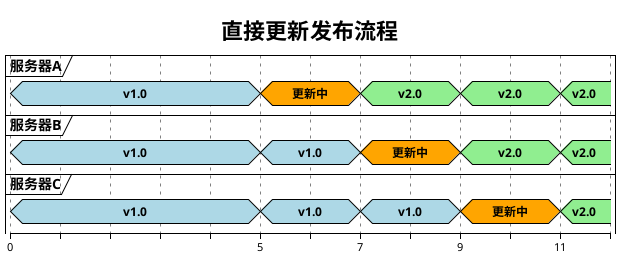

**直接更新发布特点**：
- 一次更新一台或一批服务器
- 更新期间新旧版本共存
- 仅依赖代码层面的向前兼容性保证系统正常运行
- 部署简单，资源利用率高

### 可能面临的问题

尽管向前兼容是良好的系统设计实践，但仅依赖向前兼容而不采用特定发布策略可能会面临以下问题：

#### 1. 过渡期风险

**混合版本共存问题**：
- **状态不一致**：更新过程中系统处于混合状态，部分服务器运行旧版本，部分运行新版本
- **边缘案例**：复杂交互流程可能遇到难以测试的边缘情况
- **协议兼容**：虽然代码兼容，但运行时行为可能存在细微差异

**实际案例**：
```
某支付系统在直接更新期间出现问题：新版本服务器引入了额外的验证逻辑，
而旧版本则没有。当用户支付请求先经过新版本服务进行初步处理，
再被路由到旧版本服务完成交易时，缺少必要验证字段导致交易失败。
```

#### 2. 不可控的回滚

- **部分回滚困难**：当发现问题时，可能已有部分服务器更新完成
- **回滚延迟**：全系统回滚需要时间，可能无法立即解决问题
- **状态污染**：新版本可能已修改数据或状态，回滚后数据兼容性成问题

#### 3. 监控与问题排查挑战

- **问题定位复杂**：难以确定问题是由新版本还是版本交互导致
- **监控分散**：需要同时监控新旧版本的性能和错误指标
- **用户体验监控**：难以准确衡量发布对用户体验的实际影响

#### 4. 数据库架构变更的挑战

直接更新在涉及数据库架构变更时特别棘手：

- **锁表风险**：某些DDL操作可能导致表锁定，影响线上业务
- **回滚复杂**：数据库架构一旦变更，回滚可能需要复杂的数据迁移
- **零停机挑战**：没有独立环境，难以实现完全零停机的架构变更

### 向蓝绿或灰度发布演进的路径

从简单的直接更新向蓝绿或灰度发布演进，可遵循以下路径：

#### 阶段1: 增强直接更新策略

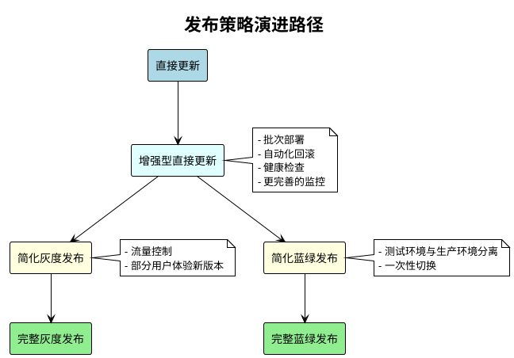

**改进措施**：
1. **引入批次发布机制**：分批次更新服务器，每批更新后观察一段时间
2. **增强监控能力**：为每个版本添加详细的指标监控和告警
3. **健康检查机制**：服务更新后自动验证关键功能
4. **自动回滚能力**：出现问题时自动回滚整个批次

#### 阶段2: 向蓝绿发布演进

**演进步骤**：
1. **环境隔离**：创建隔离的生产环境
2. **负载均衡控制**：引入可以快速切换流量的负载均衡机制
3. **数据同步策略**：解决两个环境间的数据同步问题
4. **部署流程调整**：新版本先部署到非活动环境，经过全面测试后切换

**示例实施路径**：
```
1. 规划资源，设置隔离环境，初期可以是较小规模的副本
2. 实现基础的流量切换机制，可以是简单的DNS或负载均衡器配置
3. 为部分非关键服务尝试双环境部署
4. 逐步扩展到更多服务，同时优化数据同步机制
5. 最终实现完整的蓝绿发布能力
```

#### 阶段3: 向灰度发布演进

**演进步骤**：
1. **流量分配机制**：实现能够按比例分配流量的机制
2. **用户分组策略**：按用户特征或随机方式将用户分组
3. **版本共存支持**：确保系统支持新旧版本的长期共存
4. **增量发布流程**：建立可以逐步增加新版本流量比例的发布流程

**示例实施路径**：
```
1. 实现基础的流量分流机制，初期可针对内部测试用户
2. 开发版本标记和监控能力，区分不同版本的请求与响应
3. 建立灰度发布的度量指标和决策流程
4. 从小流量测试开始，逐步建立完整的灰度发布能力
```

### 不同应用场景的最佳选择

基于向前兼容性的基础，不同场景适合不同的演进路径：

| 场景特点 | 推荐的发布策略演进 | 原因 |
|---------|-------------------|------|
| 高可用性要求，资源充足 | 直接更新 → 蓝绿发布 | 实现零停机切换，回滚快速可靠 |
| 资源有限，需要验证用户反应 | 直接更新 → 灰度发布 | 资源需求较低，可逐步验证 |
| 大型单体应用，状态复杂 | 增强直接更新 → 简化蓝绿发布 | 降低混合版本状态的复杂性 |
| 微服务架构，服务众多 | 增强直接更新 → 灰度发布 | 可针对不同服务采用不同策略 |
| 关键业务，错误成本高 | 快速向蓝绿或灰度演进 | 提高发布可靠性和回滚能力 |

### 直接更新仍有价值的场景

尽管存在局限性，在某些场景下，仅依赖向前兼容的直接更新仍是有效的选择：

1. **微小变更**：纯bug修复或简单功能增强
2. **非关键系统**：影响有限，可接受短暂问题
3. **完全无状态服务**：服务间无复杂交互
4. **资源极度受限**：无法支持多环境运行
5. **开发阶段和内部系统**：容错要求较低

### 结论

虽然仅依靠向前兼容的直接更新策略在简单场景中有效，但随着系统复杂度增加，迁移到更结构化的蓝绿发布或灰度发布策略能提供显著优势。关键是评估系统特点、业务需求和资源约束，选择适合的发布策略演进路径。

向前兼容是所有发布策略的基础，但单独依靠它不足以应对复杂系统的发布挑战。合理的发布策略不仅能降低风险，还能提高开发效率和用户体验。
