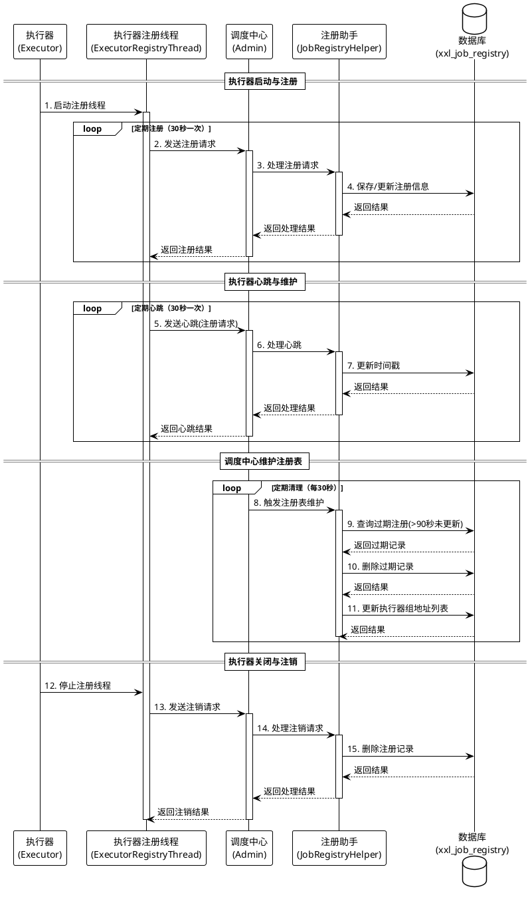

# XXL-JOB 注册中心设计

## 1. 设计理念

XXL-JOB 的注册中心是整个分布式任务调度系统的核心组件之一，其主要设计理念如下：

### 1.1 去中心化服务注册
执行器（Executor）将自身服务信息主动注册到调度中心（Admin），实现执行器自动发现。这种模式下，新增执行器机器无需人工干预，自动完成注册并纳入调度范围。

### 1.2 简单高效
采用轻量级设计，不依赖外部注册中心（如ZooKeeper、Eureka等），而是采用内建的注册表结构，降低部署复杂度和依赖成本。

### 1.3 高可用性
支持注册中心的高可用部署，确保在单点故障情况下系统仍能正常运行。

### 1.4 弹性伸缩
能够动态感知执行器的上线和下线，实现调度系统的弹性伸缩能力。

## 2. 详细设计

### 2.1 数据结构设计

#### 2.1.1 核心表结构
注册中心使用 `xxl_job_registry` 表存储注册信息：

```sql
CREATE TABLE `xxl_job_registry` (
    `id`             int(11)      NOT NULL AUTO_INCREMENT,
    `registry_group` varchar(50)  NOT NULL,          -- 注册组（EXECUTOR/ADMIN）
    `registry_key`   varchar(255) NOT NULL,          -- 注册标识（执行器AppName）
    `registry_value` varchar(255) NOT NULL,          -- 注册地址（执行器地址）
    `update_time`    datetime DEFAULT NULL,          -- 更新时间
    PRIMARY KEY (`id`),
    UNIQUE KEY `i_g_k_v` (`registry_group`, `registry_key`, `registry_value`) USING BTREE
) ENGINE = InnoDB DEFAULT CHARSET = utf8mb4;
```

#### 2.1.2 执行器分组表
执行器分组信息存储在 `xxl_job_group` 表中：

```sql
CREATE TABLE `xxl_job_group` (
    `id`           int(11)     NOT NULL AUTO_INCREMENT,
    `app_name`     varchar(64) NOT NULL COMMENT '执行器AppName',
    `title`        varchar(12) NOT NULL COMMENT '执行器名称',
    `address_type` tinyint(4)  NOT NULL DEFAULT '0' COMMENT '执行器地址类型：0=自动注册、1=手动录入',
    `address_list` text COMMENT '执行器地址列表，多地址逗号分隔',
    `update_time`  datetime DEFAULT NULL,
    PRIMARY KEY (`id`)
) ENGINE = InnoDB DEFAULT CHARSET = utf8mb4;
```

### 2.2 核心组件设计

#### 2.2.1 执行器端注册组件（ExecutorRegistryThread）
- 采用单例模式实现的注册线程
- 周期性向调度中心发送注册请求
- 支持向多个调度中心节点注册（HA方案）
- 执行器关闭时主动发送注销请求

核心工作机制：
1. 执行器启动后，创建并启动ExecutorRegistryThread线程
2. 定期（默认30秒）向所有配置的调度中心发送注册请求
3. 注册参数包含执行器组名(appname)和地址(address)信息
4. 执行器关闭时，主动向调度中心发送注销请求

#### 2.2.2 调度中心注册管理组件（JobRegistryHelper）
- 处理执行器的注册和注销请求
- 定期清理过期的注册信息
- 动态更新执行器组的地址列表

核心工作机制：
1. 调度中心启动后，创建并启动JobRegistryHelper服务
2. 使用线程池异步处理注册和注销请求
3. 通过监控线程定期扫描并移除过期的注册信息
4. 动态更新执行器组的地址列表信息

### 2.3 注册流程

1. **初始化阶段**：
   - 执行器启动时，启动内置的EmbedServer，并调用startRegistry方法
   - ExecutorRegistryThread线程被初始化并启动

2. **注册阶段**：
   - ExecutorRegistryThread定期向配置的所有调度中心节点发送注册请求
   - 请求参数包含：注册组(EXECUTOR)、注册键(appname)、注册值(address)
   - 调度中心接收到请求后，由JobRegistryHelper异步处理
   - 注册信息被保存到xxl_job_registry表中，同时更新时间戳

3. **维护阶段**：
   - 执行器定期发送心跳，更新注册中心的时间戳
   - 调度中心定期清理过期的注册记录（默认90秒未更新视为过期）
   - 调度中心定期更新执行器组的地址列表

4. **注销阶段**：
   - 执行器优雅关闭时，发送注销请求
   - 调度中心接收请求后，从注册表中删除对应记录

## 3. 高可用性设计

### 3.1 注册中心部署方案

#### 3.1.1 调度中心HA方案
调度中心支持集群部署，通过以下机制确保高可用：
- 集群节点使用同一个数据库实例，通过数据库实现数据共享
- 任务调度基于数据库锁实现，避免重复调度
- 执行器可以同时向多个调度中心节点注册，任何一个节点可用即可

部署架构：
- 多个调度中心节点前置负载均衡器（如Nginx）
- 所有节点共享同一个数据库
- 执行器配置所有调度中心节点地址（逗号分隔）

#### 3.1.2 执行器HA方案
执行器支持集群部署，通过以下机制确保高可用：
- 多个执行器节点注册到调度中心
- 调度中心根据路由策略选择执行器节点
- 支持故障转移等高可用策略

### 3.2 单点问题解决方案

#### 3.2.1 调度中心单点问题
- 解决方案：通过部署多个调度中心节点组成集群
- 关键点：所有节点共享同一数据源，保证数据一致性
- 优势：任何一个节点故障不影响整体系统运行

#### 3.2.2 执行器单点问题
- 解决方案：部署多个执行器节点，自动注册到调度中心
- 关键点：调度中心根据路由策略和可用性选择执行器
- 支持的路由策略：
  - 故障转移（Failover）：自动检测执行器可用性，故障时自动切换
  - 轮询（Round Robin）：任务均匀分配到各执行器
  - 随机（Random）：随机选择执行器
  - 一致性哈希（Consistent Hash）：相同任务尽量落在同一执行器
  - 最不经常使用（Least Frequently Used）
  - 最近最久未使用（Least Recently Used）
  - 忙碌转移：检测执行器忙碌状态，自动转移到空闲执行器

### 3.3 并发问题解决方案

#### 3.3.1 注册并发处理
- 调度中心采用线程池异步处理注册请求，避免阻塞
- 数据库表使用唯一索引（registry_group, registry_key, registry_value），确保注册信息不会重复
- 注册操作采用 "UPDATE, INSERT IF NOT EXISTS" 模式，确保数据一致性

#### 3.3.2 注册信息更新并发处理
- 调度中心监控线程使用数据库事务处理注册信息更新
- 使用乐观锁机制避免并发更新冲突
- 周期性而非实时更新执行器地址列表，降低并发压力

## 4. 设计优势与特点

### 4.1 轻量级设计
不依赖外部组件（如ZooKeeper），简化部署和维护成本。

### 4.2 自动发现
执行器自动注册，调度中心自动发现，无需人工干预。

### 4.3 高可用保障
多层次的高可用设计，确保系统整体可用性。

### 4.4 自动故障转移
具备故障检测和自动故障转移能力，提高系统稳定性。

### 4.5 低延迟
轻量化设计带来低延迟的注册和发现体验。

## 5. 流程图


