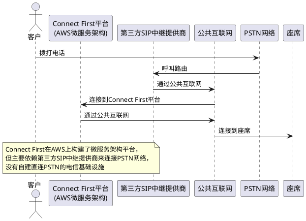
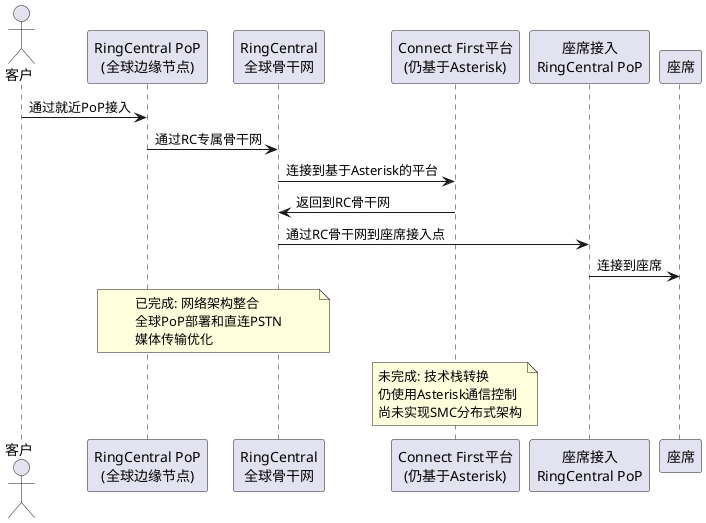
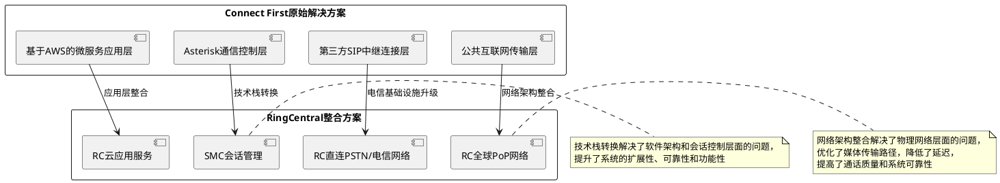

# ConnectFirst 原始网络架构分析

## 1. Connect First原始网络架构分析

根据搜索到的信息，Connect First在被RingCentral收购前采用了一种基于云的联络中心架构，其电信网络连接方式与后来RingCentral整合后的方案有明显区别。

### 1.1 Connect First原始网络架构特点

根据调研，Connect First在被收购前的架构具有以下特点：

1. **基于AWS的微服务架构**：Connect First的云平台是构建在Amazon Web Services (AWS)基础上的微服务架构。其联络中心功能通过这种架构提供了良好的扩展性，但在电信基础设施上存在局限。

2. **依赖第三方SIP中继提供商**：Connect First不像RingCentral那样拥有自己的CLEC(竞争性本地交换运营商)牌照和电信基础设施，而是完全依赖第三方SIP中继提供商来连接PSTN网络。

3. **缺乏直接PoP连接**：Connect First没有建立自己的PoP(Point of Presence)边缘节点网络，也未与电信运营商建立直接互联。所有呼叫都必须经过公共互联网和第三方SIP中继提供商，增加了网络延迟和潜在的质量问题。

4. **客户群体特点**：Connect First服务的客户包括ASPCA、Carnival Cruise Line、Party City、PBS和United Way等企业，以及Charter Cable、Comcast和SiriusXM等服务提供商，这些客户对呼出电话和混合式客户互动有较高需求。

### 1.2 网络冗余与SIP中继问题

Connect First原始架构中的SIP中继连接存在几个核心问题：

1. **冗长的网络路径**：呼叫必须经过多个中间环节（公共互联网→SIP中继提供商→Connect First平台→公共互联网→座席），导致媒体路径冗长。

2. **较高的延迟**：多跳转路径导致端到端延迟增加，尤其是在全球分布式部署场景下更为明显。

3. **服务质量不可控**：依赖公共互联网传输使得服务质量受网络拥塞影响较大，难以保证一致的通话质量。

4. **有限的扩展能力**：依赖第三方SIP中继限制了其全球扩展的能力，特别是在需要覆盖多个地理区域时。

### 1.3 为何不直接采用PoP模式

Connect First确实可以考虑与拥有PoP的公司合作来改善其网络架构，但没有这样做的原因可能包括：

1. **业务发展阶段限制**：作为一家相对较小的CCaaS提供商，Connect First可能缺乏建立全球PoP网络所需的资源和规模。

2. **成本考量**：建立或租用全球PoP网络需要大量资本投入，对于规模较小的公司而言成本较高。

3. **技术路线选择**：Connect First可能将技术资源更多投入到其应用功能而非底层网络基础设施的发展上。

4. **商业模式差异**：Connect First专注于提供外拨和混合式客户互动平台，而非全面的UCaaS解决方案，因此对网络基础设施的需求与RingCentral有所不同。

## 2. Asterisk到SMC转换与网络整合的关联分析

### 2.0 过渡阶段网络架构（已完成PoP网络整合但未完成SMC技术改造）

在RingCentral收购Connect First后，整合过程分为多个阶段进行。在过渡阶段，RingCentral首先完成了网络基础设施的整合（PoP网络接入），但Asterisk到SMC的技术栈转换尚未完成。这一中间状态的架构如下：

这一过渡架构具有以下特点：

1. **已优化的网络传输**：
   - 通过RingCentral的全球PoP网络接入，优化了媒体路径
   - 客户和座席都可通过就近PoP接入，减少了网络延迟
   - 利用RingCentral专属骨干网替代了公共互联网传输
   - 不再依赖第三方SIP中继，直接连接PSTN网络

2. **未升级的通信控制层**：
   - 仍然使用基于Asterisk的Connect First平台处理呼叫控制逻辑
   - 没有实现SMC的分布式会话管理和弹性扩展能力
   - 功能仍受Asterisk架构局限，难以满足大规模部署需求

3. **整合挑战**：
   - 新网络基础设施与老技术栈的适配问题
   - 系统可靠性提升有限，仍存在单点故障风险
   - 新功能开发受限于Asterisk架构

这一过渡阶段架构说明了网络整合与技术栈转换是两个独立但相互关联的过程，也解释了为什么RingCentral需要同时完成这两方面的整合才能提供最优的服务体验。在这一阶段，客户已经能够感受到网络质量的提升，但系统的可扩展性、可靠性和功能丰富度还未完全实现。

### 2.1 综合视角分析

当我们从更全面的视角看待问题时，可以发现：

1. **互补关系**：
   - Asterisk到SMC的转换和网络架构整合是相互补充的两个方面
   - 前者解决了软件架构和会话控制的问题，后者解决了网络传输和基础设施的问题

2. **共同目标**：
   - 两者都旨在提升通信质量、系统可靠性和业务连续性
   - 两者结合能够提供端到端的优化体验

3. **协同效应**：
   - SMC的分布式架构需要高效的网络基础设施来发挥其潜力
   - 网络整合后的低延迟传输使SMC的高级功能得以充分体现

### 2.2 整合必要性分析

Connect First在被收购前面临的核心挑战集中在两个方面：

1. **技术栈局限性**：
   - Asterisk作为开源软件虽然功能丰富，但在大规模部署、高可用性和云原生适配方面存在局限
   - 单体架构难以满足大规模联络中心的扩展需求

2. **网络基础设施不足**：
   - 依赖第三方SIP中继和公共互联网传输，缺乏直接电信基础设施
   - 没有全球分布的PoP网络，难以优化全球范围内的媒体传输路径

RingCentral的整合方案针对这两个方面进行了全面升级：

- **SMC转换**提供了更强大的会话控制能力、更高的可扩展性和更丰富的功能
- **网络整合**优化了媒体传输路径，降低了端到端延迟，提升了通话质量

这种双重整合不是简单的技术升级，而是对整个服务交付模式的重构，使RingCentral能够以更高质量、更低成本和更大规模提供云通信服务，为客户创造更大价值。

## 3. 总结

通过对Connect First原始架构和RingCentral整合方案的分析，我们可以看到：

1. Connect First虽然在应用层采用了先进的微服务架构，但在电信网络基础设施方面存在明显局限，过度依赖第三方SIP中继和公共互联网传输。

2. RingCentral的整合方案从技术栈转换(Asterisk到SMC)和网络架构整合两个维度进行了全面升级，这不仅提升了系统的技术能力，也优化了网络传输路径，显著提升了服务质量。

3. 这种全方位整合的效果远超单一技术升级，使RingCentral能够提供端到端优化的云通信服务，满足从小型企业到大型跨国公司的各类需求。

这一案例展示了在云通信服务领域，软件架构和网络基础设施的协同优化对服务质量和用户体验的关键影响，也反映了成熟UCaaS提供商与专注单一领域的CCaaS提供商在技术能力和服务交付模式上的差异。