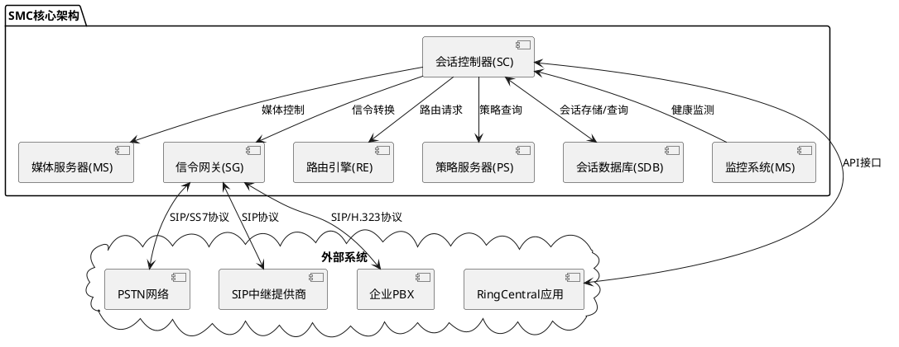
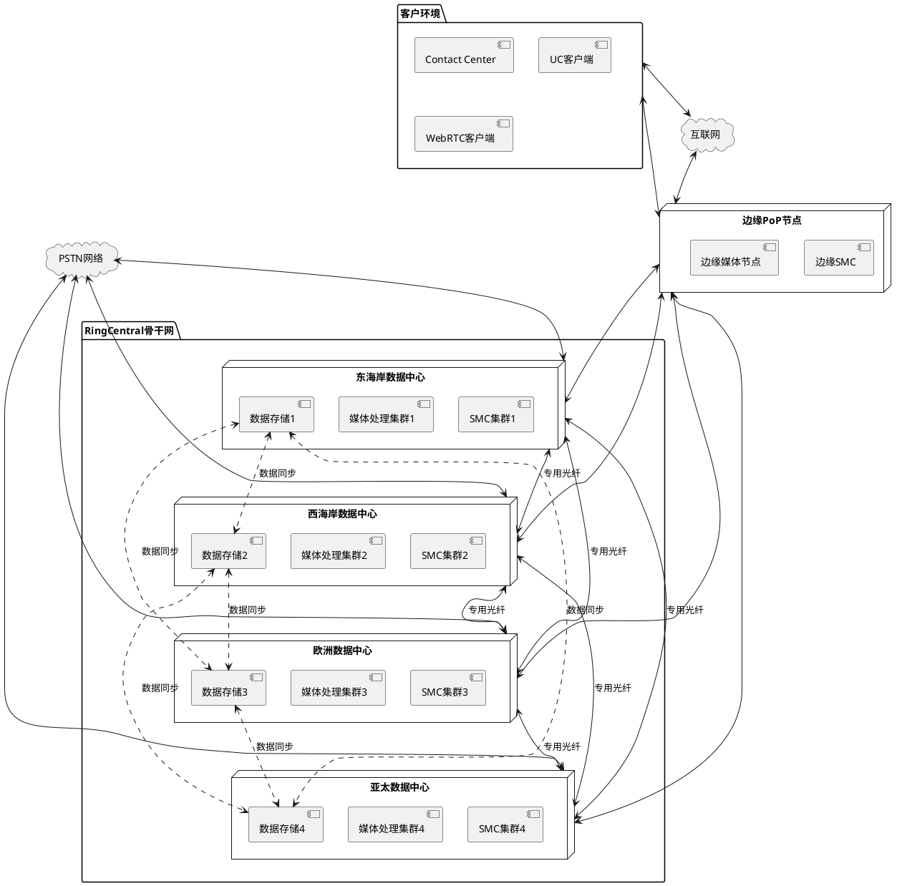
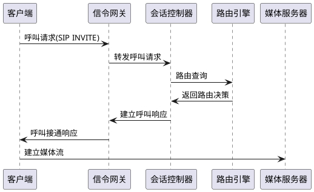
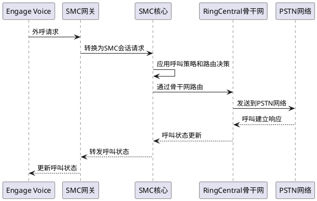
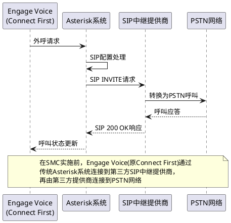

# RingCentral SMC架构方案

## 文档概述

本文档详细描述了RingCentral自主研发的SMC(Session Management Controller)架构，这是RingCentral将Connect First(Engage Voice)接入自有电信网络过程中的核心技术组件。本设计方案于2019年Q3-Q4确定，并在2020-2021年间实施完成。

## 1. SMC简介

### 1.1 什么是SMC

SMC(Session Management Controller)是RingCentral自主研发的新一代会话管理控制器，作为企业级通信平台的核心组件，负责管理、控制和路由所有类型的通信会话。SMC替代了传统的开源Asterisk系统，为RingCentral提供更高级的呼叫控制能力、更好的可扩展性和更高的可靠性。

### 1.2 设计目标

- **统一架构**：建立统一的会话管理架构，支持RingCentral所有通信产品线
- **高可靠性**：实现N+1冗余架构，保证99.999%的服务可用性
- **高扩展性**：支持水平扩展，满足不断增长的业务需求
- **低延迟**：通信路径优化，端到端延迟<50ms
- **媒体优化**：优化媒体处理和路由，提高语音质量
- **安全加密**：支持端到端加密通信
- **运营商级功能**：实现符合CLEC标准的电信级功能集

## 2. 架构设计原则

### 2.1 云原生设计

- 基于Kubernetes容器化部署
- 微服务架构，功能模块化
- 无状态设计，支持弹性扩展
- API驱动的服务交互

### 2.2 多层冗余

- 地理分散式部署
- 组件级高可用设计
- 数据多副本存储
- 自动故障检测和恢复

### 2.3 安全优先

- 媒体和信令加密
- 多层访问控制
- 实时安全监控
- 合规认证支持(HIPAA, GDPR, PCI DSS等)

## 3. SMC核心组件

### 3.1 会话管理层

- **会话控制器(Session Controller)**：处理所有通信会话的建立、维护和终止
- **信令网关(Signaling Gateway)**：处理不同信令协议之间的转换和互通
- **路由引擎(Routing Engine)**：基于策略和状态进行智能呼叫路由
- **策略服务器(Policy Server)**：管理通信策略和规则配置
- **会话数据库(Session Database)**：存储会话状态和历史记录

### 3.2 媒体处理层

- **媒体服务器(Media Server)**：处理媒体流转发、混合和处理
- **转码引擎(Transcoding Engine)**：处理不同编解码器之间的转换
- **媒体质量监控(Media Quality Monitor)**：实时监控音视频质量
- **录音服务(Recording Service)**：提供通话录音和存储功能

### 3.3 互联层

- **PSTN互联网关**：连接传统电话网络
- **SIP互联服务**：连接SIP中继提供商
- **WebRTC网关**：支持基于浏览器的通信
- **API网关**：提供外部系统集成接口

## 4. 网络拓扑结构

### 4.1 全球分布式架构

- 东西海岸核心数据中心
- 欧洲和亚太区域数据中心
- 200+全球边缘PoP接入点
- 多层级互联网络

### 4.2 流量管理

- BGP Anycast智能路由
- 跨地域负载均衡
- 流量优先级控制
- 动态拥塞管理

## 5. SMC与Asterisk对比

| 功能特性 | SMC架构 | Asterisk架构 |
|---------|--------|-------------|
| **架构设计** | 云原生分布式 | 单体应用 |
| **扩展性** | 水平无限扩展 | 垂直扩展受限 |
| **冗余模式** | 多区域N+1冗余 | 主备模式 |
| **容量** | 单集群支持10万+并发会话 | 单实例1000-2000并发 |
| **会话管理** | 集中式+分布式混合 | 仅本地会话管理 |
| **媒体处理** | 分布式媒体服务器集群 | 集中式媒体处理 |
| **信令协议** | 原生多协议支持 | 需插件扩展 |
| **延迟指标** | <50ms端到端延迟 | 不稳定，可能>200ms |
| **运维复杂度** | 自动化管理 | 手动管理为主 |
| **监控能力** | 全链路实时监控 | 基础监控功能 |

## 6. 通信流程

### 6.1 基本呼叫流程

### 6.2 Engage Voice集成流程(Latest)

### 6.3 Engage Voice集成流程(Old)

## 7. 技术规格与性能指标

### 7.1 基础规格

- 单一SMC集群支持10万+并发通话会话
- 呼叫建立时间<200ms
- 端到端延迟<50ms
- 会话建立成功率>99.999%
- 系统可用性>99.999%

### 7.2 媒体处理能力

- 支持多种编解码(G.711, G.722, Opus, SILK等)
- 支持实时转码和混音
- 媒体加密(SRTP/ZRTP)
- 自适应带宽调整
- 丢包隐藏与恢复

### 7.3 安全特性

- TLS/SRTP加密所有通信
- 多因素认证
- 实时威胁监测
- DDoS防护能力
- 合规安全日志

## 8. 向SMC的迁移策略

### 8.1 迁移阶段

1. **评估阶段**：分析Connect First基础设施和通信模式
2. **设计阶段**：确定SMC集成架构和迁移路径
3. **平行测试**：部署SMC并与Asterisk并行运行
4. **逐步切换**：按客户群分批迁移
5. **完全迁移**：停用Asterisk组件

### 8.2 风险管控

- 双系统并行运行
- 灰度发布策略
- 实时监控与回滚机制
- 客户沟通与支持计划

## 9. 业务价值

### 9.1 成本效益

- 降低40-60%的PSTN互联成本
- 降低基础设施维护成本
- 提高运营效率

### 9.2 质量提升

- 降低30-50%的平均网络延迟
- 提高15-25%的外呼连接率
- 降低40%以上的通话掉线率

### 9.3 功能增强

- 支持大规模外呼活动
- 提供实时质量监控
- 启用高级合规功能

### 9.4 战略价值

- 为AI和自动化提供基础架构
- 创造市场差异化优势
- 支持全渠道通信愿景

## 10. 参考链接

1. [RingCentral Unified Communications Reference Architecture](https://support.ringcentral.com/ca/en/network-and-system-requirements/network-requirements/overview/ringcentral-unified-communications-reference-architecture.html)
2. [RingCentral Contact Center Central 2020 Release Notes](https://support.ringcentral.com/ca/en/release-notes/customer-engagement/contact-center/release-notes-summer-2020.html)
3. [RingCentral Voice Quality Monitoring Technical Overview](https://partnersupport.ringcentral.com/network-and-system-requirements/network-requirements/overview/ringcentral-unified-communications-reference-architecture.html)
4. [Session Management Controller: The Next Evolution of the SBC](https://www.nojitter.com/session-management-controller-next-evolution-sbc) (业界参考文章)
5. [RingCentral Session Border Controller (SBC) Configuration Guide](https://support.ringcentral.com/article/8186.html)

---

## 附录A: SMC核心技术规格

| 组件 | 规格详情 |
|------|---------|
| **会话控制器** | 单节点支持5000会话，水平扩展至N节点 |
| **媒体服务器** | 单节点支持2000流，水平扩展 |
| **信令吞吐量** | 每秒10万+SIP消息处理能力 |
| **路由决策速度** | <5ms路由决策时间 |
| **存储系统** | 分布式NoSQL数据库，多区域复制 |
| **网络要求** | 数据中心间<5ms网络延迟 |
| **计算资源** | 基于Kubernetes编排，自动扩缩容 |
| **监控系统** | 秒级指标采集，毫秒级异常检测 |

## 附录B: 部署检查清单

- [ ] 数据中心网络连接验证
- [ ] SMC核心组件部署
- [ ] 媒体服务器集群配置
- [ ] PSTN互联网关配置
- [ ] SIP中继提供商集成
- [ ] 路由策略配置
- [ ] 负载均衡器设置
- [ ] 安全策略应用
- [ ] 监控告警配置
- [ ] 灾备演练
