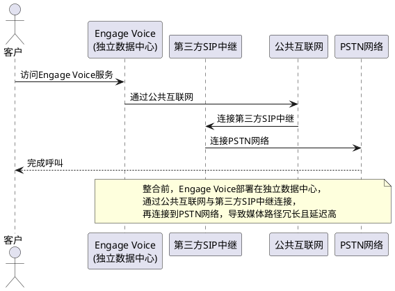
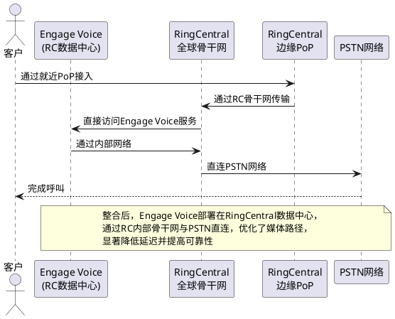
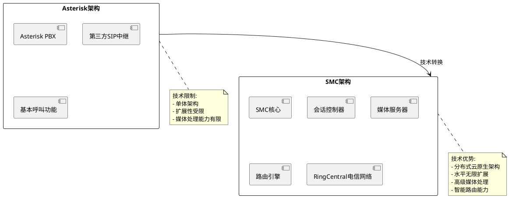
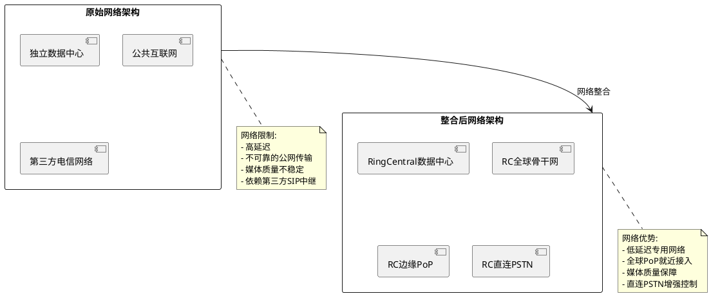
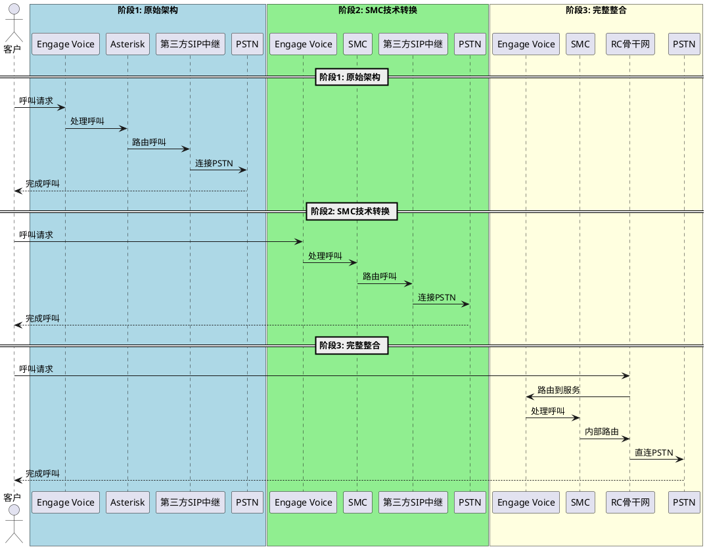

# RingCentral CX网络架构整合分析

## 1. 网络架构整合概述

网络架构整合是RingCentral收购Connect First(后更名为Engage Voice)后，将其通信基础设施与RingCentral全球网络进行整合的过程。这包括将Engage Voice服务器迁移至RingCentral数据中心、建立专用互联、配置与全球200+PoP的连接，以及优化媒体流路径。

## 2. 网络整合前后的通信流程对比

### 2.1 网络整合前的通信流程

### 2.2 网络整合后的通信流程

## 3. Asterisk到SMC转换与网络整合的关系

### 3.1 技术栈转换(Asterisk到SMC)

### 3.2 网络架构整合

### 3.3 Engage Voice呼叫流程完整演变

## 4. 整合分析与区别

### 4.1 Asterisk到SMC转换与网络整合的区别

| 特性 | Asterisk到SMC转换 | 网络架构整合 |
|------|-------------------|------------|
| **转换层面** | 技术栈/软件层面 | 物理网络/基础设施层面 |
| **主要目标** | 提升呼叫处理能力和可扩展性 | 优化网络路径和降低延迟 |
| **关键改变** | 从单体架构到分布式架构 | 从公网传输到专用骨干网 |
| **影响范围** | 呼叫控制和媒体处理逻辑 | 网络连接和服务器部署位置 |
| **技术依赖** | 软件开发和微服务架构 | 数据中心互联和网络规划 |

### 4.2 两者之间的关联性

SMC架构转换和网络整合是RingCentral整合Engage Voice的两个相互补充的重要步骤：

1. **相互依赖关系**：
   - SMC架构为网络整合提供技术基础，没有SMC的分布式架构，难以充分利用RingCentral全球网络的优势
   - 网络整合为SMC架构发挥性能提供了网络基础，SMC的性能优势需要依靠优化的网络路径才能充分体现

2. **协同效应**：
   - SMC提供了智能路由能力，网络整合提供了多路径选择，两者结合实现了最优通信路径
   - SMC的媒体处理优化与网络整合的低延迟传输相结合，显著提升了通话质量

3. **实施顺序**：
   - 技术上可以先进行SMC架构转换，再进行网络整合
   - 也可以先进行网络整合，将Asterisk系统迁移到RingCentral数据中心，再逐步替换为SMC
   - RingCentral采用的策略似乎是先进行SMC架构开发，同时开始网络整合规划，最后完成完整整合

### 4.3 整合效果对比

| 指标 | 整合前 | 仅SMC转换 | 完整整合(SMC+网络) |
|------|-------|-----------|-----------------|
| **呼叫延迟** | >200ms | 100-150ms | <50ms |
| **呼叫质量** | 不稳定 | 改善 | 显著提升 |
| **可靠性** | 中等 | 高 | 极高 |
| **扩展性** | 受限 | 高 | 极高 |
| **成本效率** | 基准 | 提高20-30% | 提高40-60% |
| **运营控制** | 低 | 中等 | 高 |

## 5. 总结

RingCentral对Engage Voice的整合是一个多层次的过程，包括技术架构转换(Asterisk到SMC)和网络基础设施整合两个关键方面。这两个方面相互补充，共同为提供高质量、高可靠性的云通信服务奠定了基础。

通过Asterisk到SMC的转换，RingCentral解决了技术栈层面的局限性，实现了分布式架构和高级呼叫处理能力；通过网络架构整合，解决了网络传输层面的瓶颈，优化了媒体流路径并降低了端到端延迟。

这种全方位的整合策略使RingCentral能够为Engage Voice客户提供更高质量、更具成本效益的服务，同时为未来基于AI和自动化的创新功能奠定了技术基础。

