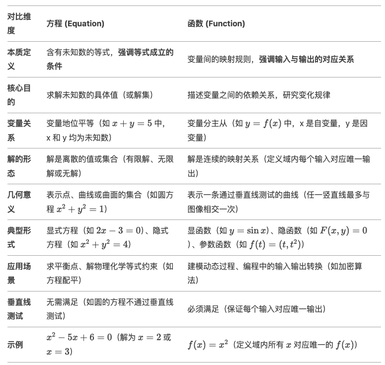

# 基础

## 代数和几何(个人扩展)

### 代数

> **核心思想**：用**符号（字母、数字）**表示**未知数或变化的量**，通过**运算规则**解决问题。
>
> 像数学的“侦探游戏”，用**符号和方程**破解未知数的秘密
> **动态的、抽象的关系**

- 对小学生：
  - 比喻：代数就像“数学的魔法盒子”。
    - 比如，你有一个存钱罐，你不知道里面有多少钱，但你可以用字母（比如⚡️）代替这个未知的数量。
    - 如果妈妈又放了3元进去，现在总共有⚡️+3元。这就是代数——用符号代替未知数，然后通过计算找到答案。
- 对初中生：
  - 定义：**代数是数学中研究数字和符号关系的分支**，通过**方程**（如 x+5=12）**解决实际问题**。
  - 例子：如果你每天存2元，存了几天后总共有10元，可以用方程 2x=10 算出天数 x=5。
  - 关键点：代数帮助我们找到未知数的值，或者分析数量如何变化（比如速度、时间、距离的关系）。

### 几何

> **核心思想**：研究**形状、大小、位置和空间关系**的数学分支
>
> 像数学的“建筑师手册”，用**图形和空间规则**建造世界
> **静态的、视觉化的关系**

- 对小学生：
  - 比喻：几何就像“图形的探险”。
  - 比如，用积木搭房子时，积木有不同的形状（三角形、正方形），几何就是研究这些形状的规则：
    - 三角形为什么稳定？
    - 圆的轮子为什么能滚动？
  - 还可以用折纸或画画解释角度、对称等概念。
- 对初中生：
  - 定义：**几何研究图形的性质（如边长、角度、面积）和空间关系（如平行、垂直、相似）**
  - 例子：用勾股定理计算直角三角形的边长，用坐标系描述点的位置（如GPS定位）。
  - 关键点：几何不仅是理论，还用于建筑、地图、艺术设计等实际领域。

## 二次函数

- 十字相乘法
- 函数图形法(不等式)
- 求根公式、对称轴、delta △、b、a的含义
- 韦达定理

## 绝对值

- 代数意义
- 几何意义
- 高中解法
  - 分类讨论
  - 几何法

## 线性方程与不等式

### 一元一次方程(直线方程)

`y = kx + b`, 表示直线的倾斜程度

#### 斜率(k)

- k的来源
  - k 可能来源于德语 "Koeffizient"，而 m 则与英语单词 "slope" 或其同义词相关
  - k 和 m 都是斜率的常见符号，具体使用取决于地区或教材的习惯

### 二元一次方程(曲线方程)

`y = ax² + bx + c`, 没有斜率的概念, 图形是抛物线（曲线）。但**抛物线上某一点的切线斜率**需要导数计算（如dy/dx=2ax+b），而非直接由方程中的符号表示
  
#### 顶点坐标

`y = a(x - h)² + k`，其中，a ≠ 0，h 和 k 为常数。顶点式的形式可以直接反映抛物线的顶点坐标 (h, k)，对称轴为直线 x = h

> 顶点式通过配方法将二次函数转化为**以顶点为中心的对称形式**，使得抛物线的几何特性（顶点、对称轴、开口方向）一目了然
>

- 推导
  - 从一般式 `y = ax² + bx + c` 出发
  - 提取系数 a：`y = a(x² + (b/a)x) + c`
  - 配方并整理：`y = a(x + b/(2a))² + (4ac - b²)/(4a)`
  - 可以得到对称轴取值为  (`-b/(2a)`, `(4ac - b²)/(4a)`)
    - ❌ 不需要记住顶点坐标的纵坐标y值，✅ 可以记住横坐标x=`-b/2a`后带入方程获得y
    - ✅ 根据韦达定理 x1+x2=-b/a，而顶点是 x = (x1+x2)/2 => -b/2a 几何性质把2个知识关联起来
    - ✅ 高阶技巧：掌握配方法，理解顶点式的几何意义（对称性与极值），而非依赖公式本身
- 为什么顶点式能直接体现顶点？
  - **几何意义**
    - 顶点是抛物线的最高点或最低点。在顶点式中，当 x = h 时，平方项 (x - h)² 达到最小值 0，此时 y = k。因此，无论 a 是正还是负，(h, k) 都是抛物线的“转折点”
  - **对称性**
    - 顶点式的结构 a(x - h)² + k 表明，抛物线上任意一点 (x, y) 关于 x = h 对称

##### 个人理解

二次函数的图像是抛物线，其核心特性是对称性。抛物线上除顶点外的任意一个非极值点y，都对应两个关于对称轴对称的 x 值。而顶点 (h,k) 是抛物线的唯一极值点，此时方程 `a(x - h)² + k` 仅有一个解 。这种“唯一解”的特性，使得顶点在顶点式中被直接凸显出来。

- **对称轴与唯一性**
  - 顶点位于对称轴 x=h 上，是抛物线上唯一不满足“一对x对应同一y”的点。这种唯一性通过顶点式中的常数项k直接体现
- 代数视角
  - 方程 `a(x - h)² + k` 有唯一解, 则 x-h 必然为0，解为 k

#### 对称轴

- 二次函数本质上是一条抛物线，抛物线存在对称轴
- 公式
  - x=-(b/2a)

#### 求根公式

#### delta(Δ）

- 掌握推导过程
- delta(Δ）推导过程
  - 首先，把方程两边都除以a，得到x² + (b/a)x + c/a = 0。然后，把常数项移到右边，变成x² + (b/a)x = -c/a。接下来，需要配方，也就是把左边变成一个完全平方的形式
  - 配方的步骤是在x² + (b/a)x的基础上加上(b/(2a))²，也就是(b²)/(4a²)，这样左边就可以写成(x + b/(2a))²。但是，为了保证等式成立，右边也要加上同样的量，所以右边变成 -c/a + b²/(4a²)
  - 接下来，整个方程变成(x + b/(2a))² = (b² - 4ac)/(4a²)。这时候，两边开平方，得到x + b/(2a) = ±√(b² - 4ac)/(2a)。然后移项得到x = [-b ± √(b² - 4ac)]/(2a)，这就是求根公式
  - **b² - 4ac，它决定了方程是否有实数根**。如果这个值是正的，就有两个不同的实数根；如果是零，就有一个重根；如果是负的，就没有实数根，而是复数根

#### 韦达定理(对二次函数有效)

- 公式
  - x1+x2=-(b/a)
  - x1*x2=c/a
- 掌握推导过程
- 定理的意义
  - 快速构造方程：已知根时，可直接写出方程 x²-((x1+x2)x)+(x1x2) = 0
  - 简化运算：无需解方程即可通过系数求根的和与积
  - 联系几何与代数：将抛物线的交点性质转化为代数表达式
    - 二次函数本质上是一条抛物线，抛物线存在对称轴，**对称轴为 x=-(b/2a)**, 两根x1、x2基于对称轴两侧
    - **根之和**的几何意义是两交点横坐标的平均值的两倍. 有公式 x = (x1+x2)/2 = -(b/2a)，推导出 x1+x2 = -(b/a)
    - **根之积** 则反映了抛物线与x轴交点的“覆盖范围”，与顶点纵坐标相关
  
## 函数

- f(x)=ax²+bx+c
  - a 决定了
    - 基本的抛物线是y = x²，开口向上。**当a变化时，相当于对这个基本抛物线进行纵向的拉伸或压缩，以及翻转**
    - 当 a>0，随着x的绝对值增大，ax²的值会迅速增大，导致y的值也增大，因此抛物线会向上张开
    - 当 a<0，随着x的增大，ax²为负，y值会减小，所以开口向下
    - |a| 越大：抛物线越窄；|a| 越小：抛物线越宽
  - b 决定了
  - c 决定了

### 方程与函数的关系

- 方程是条件，函数是规则
- 方程求特定解，函数研究全局关系
- 方程变量平等，函数变量主从分明
